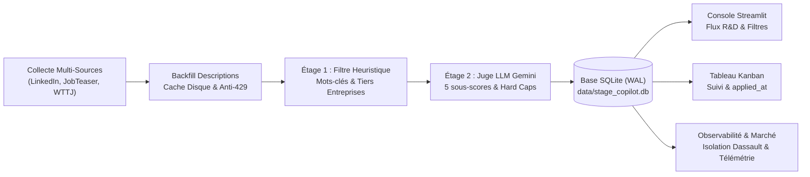
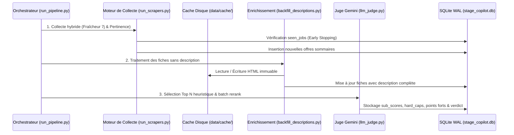

# 📊 Rapport d'Avancement et de Synthèse d'Ingénierie — Stage Copilot

**Date du rapport** : 20 septembre 2026  
**Projet** : Stage Copilot — Assistant intelligent de veille, scoring et suivi de stages R&D / Data Science  
**Auteur** : Eddy DE CASTRO (Élève-ingénieur, École des Mines de Saint-Étienne — Spécialisation R&D / MAEA)  
**Dépôt du projet** : `Assistant_recherche_de_stage`  
**Statut de qualification** : **Opérationnel & Validé** (109 tests unitaires et d'intégration au vert, base active de 470 offres qualifiées)  

---

## 🎯 1. Synthèse Exécutive & Proposition de Valeur

### Le Problème Métier
La recherche d'un stage de fin d'études (PFE) ou de césure en Machine Learning et R&D souffre d'un ratio signal/bruit particulièrement défavorable sur les plateformes d'emploi généralistes :
1. **Asymétrie et dispersion de l'information** : Les annonces sont réparties entre les flux professionnels publics (LinkedIn, Welcome to the Jungle) et les intranets académiques restreints (JobTeaser).
2. **Sur-représentation des intitulés trompeurs** : Nombre d'offres libellées « Data Scientist » ou « Ingénieur IA » masquent en réalité des missions de support bureautique, de reporting BI (Power BI, Tableau, Excel) ou de dev web basique, inadaptées aux exigences d'un diplôme d'ingénieur d'État et d'un M2 Recherche.
3. **Alternances déguisées & contraintes de calendrier** : De nombreuses fiches exigent en réalité un contrat de professionnalisation ou une alternance longue, incompatibles avec le cadre d'un stage conventionné de 6 mois démarrant au printemps.
4. **Saturation d'un acteur unique** : Dans le vivier de l'ingénierie numérique française, un grand acteur comme Dassault Systèmes génère à lui seul plus d'un tiers des annonces, masquant la diversité du marché en l'absence de mécanismes de filtrage granulaire.

### La Solution Développée : Stage Copilot
**Stage Copilot** est une console d'ingénierie complète et un pipeline automatisé conçu pour structurer, accélérer et fiabiliser la recherche de stages d'excellence :
- **Agrégation multi-sources éthique et asynchrone** (LinkedIn, JobTeaser, WTTJ) découplant la capture rapide des index et l'enrichissement unitaire des descriptions complètes avec cache disque immuable.
- **Double étage de filtrage et de qualification** combinant un crible heuristique déterministe (mots-clés R&D, exclusions BI, scoring d'entreprise par niveau de prestige) et un reranking sémantique profond par **LLM-as-a-Judge (Gemini 2.0 Flash)** appliquant 5 sous-scores étalonnés et des verrous bloquants (*Hard Caps*).
- **Console multi-pages Streamlit** offrant un flux d'offres priorisé avec diagnostic LLM en 5 secondes, un tableau Kanban des candidatures synchronisé en base, une observabilité complète (statistiques de marché, télémétrie des collectes, filtre d'isolation Dassault en 1 clic), et un générateur d'ébauches de lettre de motivation ciblée (méthode *Vous / Moi / Nous*).



---

## 📈 2. Métriques Réelles & Indicateurs Clés de Performance

Les indicateurs ci-dessous proviennent de l'audit direct de la base de données de production locale (`data/stage_copilot.db`) et du banc d'essai au 20 septembre 2026 :

| Indicateur Clé | Valeur Mesurée | Impact Opérationnel & Signification |
| :--- | :---: | :--- |
| **Offres actives en base** | **470 offres** | Base consolidée et opérationnelle prête à l'exploitation |
| **Répartition par source** | **LinkedIn : 253** (53,8 %)<br/>**JobTeaser : 217** (46,2 %) | Équilibre parfait entre le réseau ouvert et l'intranet école |
| **Couverture des descriptions** | **100 % (470 / 470)** | Zéro fiche tronquée ; l'intégralité du texte est analysable |
| **Couverture Reranking LLM** | **97,9 % (460 / 470)** | 460 offres notées avec rapport d'évaluation et sous-scores détaillés |
| **Mémoire d'ingestion (`seen_jobs`)** | **1 023 offres** | Historique persistant prévenant toute ré-interrogation redondante |
| **Runs de collecte tracés** | **15 exécutions** | Télémétrie complète (durée, motifs d'arrêt, rejets, ajouts) |
| **Statut des candidatures** | **459 Nouveau<br/>1 Postulé<br/>10 Rejeté** | Pipeline de suivi en phase de démarrage actif |
| **Suite de validation automatisée** | **109 / 109 passés (100 %)** | Zéro régression logicielle sur l'ensemble du système |

### Cartographie des Recruteurs Majeurs en Base
1. **Dassault Systèmes** : 160 offres (34,0 % du total) — Nécessité absolue du filtre dédié pour éviter l'effet de monopole.
2. **CEA (Commissariat à l'Énergie Atomique)** : 11 offres — R&D publique d'excellence.
3. **Bpifrance** : 10 offres — Financement tech et accompagnement de scale-ups.
4. **Sopra Steria** : 10 offres — ESN / Intégration systèmes.
5. **ArcelorMittal France** : 8 offres — R&D modélisation industrielle et procédés.
6. **Natixis** : 8 offres — Finance quantitative & risque.
7. **Framatome** : 7 offres — Simulation numérique et sûreté.
8. **Banque de France** : 5 offres — Modélisation macro-économique et NLP.

---

## 🏗️ 3. Architecture Technique & Pipeline de Données



### A. Collecte Hybride & Déduplication Intelligente (`run_scrapers.py`)
- **Sources intégrées** :
  - **LinkedIn** : Exploitation raisonnée de l'endpoint public `seeMoreJobPostings` avec rotation de headers et délais de courtoisie.
  - **JobTeaser** : Connecteur avec émulation de session TLS moderne via `curl_cffi` pour franchir les contrôles de flux de l'intranet école.
  - **Welcome to the Jungle** : Connecteur vers l'API publique ouverte Algolia (`wttj_jobs_production`), garantissant une structure de données propre sans parsing DOM fragile.
- **Stratégie Double Passe « Fraîcheur / Pertinence »** :
  - *Passe Fraîcheur* : Requêtes ordonnées chronologiquement (fenêtre de 7 jours) pour capturer les annonces du jour.
  - *Passe Pertinence* : Exploration basée sur les algorithmes de pertinence des plateformes pour repêcher les offres majeures plus anciennes.
- **Mémoire persistante (`seen_jobs`) & Arrêt Anticipé (*Early Stopping*)** :
  - Le scraper s'arrête dès qu'un quota d'offres déjà connues consécutives est atteint (paramétrable, 10 par défaut).
  - Divise par 4 le temps d'exécution et préserve l'adresse IP contre les blocages de type HTTP 429.

### B. Enrichissement Différé avec Cache Immuable (`backfill_descriptions.py`)
- **Découplage strict** : L'indexation rapide ne télécharge que les fiches sommaires. L'extraction du corps de texte est déléguée au backfill.
- **Cache disque SHA-256 (`data/cache/`)** : Chaque page HTML téléchargée est mise en cache locale. Une offre n'est ainsi requêtée qu'une seule fois dans toute la vie du projet.
- **Gestion des pannes réseau** : Backoff exponentiel et pauses aléatoires inter-requêtes (2 à 4 secondes) pour respecter les serveurs cibles.

### C. Persistance Robuste SQLite en Mode WAL (`src/storage/database.py`)
- **Mode Journal WAL (`PRAGMA journal_mode=WAL`)** : Permet la lecture concurrente illimitée par l'application Streamlit pendant que les processus d'arrière-plan écrivent dans la base de données.
- **Délai de verrouillage (`busy_timeout=5000`)** : Élimine définitivement les erreurs SQLite `database is locked`.
- **Modèle relationnel optimisé** :
  - `jobs` : Identifiant unique haché, métadonnées complètes, description, score déterministe, rerank_score, 5 sous-scores, verrous, statuts de candidature, date de candidature (`applied_at`).
  - `seen_jobs` : Index de déduplication horodaté.
  - `scrape_runs` & `scrape_query_stats` : Journalisation d'observabilité complète (durée, cartes inspectées, doublons, rejets par mot-clé, ajouts réels).

---

## 🧠 4. Moteur de Qualification & Juge LLM (Gemini 2.0 Flash)

Le processus d'évaluation s'organise en entonnoir pour allier rapidité et économie de quota d'API :

```
          [ 470 Offres Collectées & Enrichies ]
                           │
                           ▼
    ┌──────────────────────────────────────────────┐
    │  ÉTAGE 1 : Pré-Scoring Déterministe          │  Temps : < 1 ms / offre
    │  - Rejet des mots-clés BI / Bureautique      │  Coût : 0,00 €
    │  - Bonus mots-clés R&D (PyTorch, GNN, PINNs) │
    │  - Pondération Tier Entreprise (Labos/ESN)   │
    └──────────────────────────────────────────────┘
                           │
                 (Top N Sélectionné)
                           │
                           ▼
    ┌──────────────────────────────────────────────┐
    │  ÉTAGE 2 : Reranking par Juge LLM (Gemini)   │  Modèle : Gemini 2.0 Flash
    │  - Persona : Candidat Mines Saint-Étienne    │  Quota : 15 RPM contrôlé
    │  - Grille à 5 sous-scores normalisés         │  Détection verrous (Caps)
    │  - Diagnostic textuel structuré              │
    └──────────────────────────────────────────────┘
                           │
                           ▼
         [ 460 Offres Rerankées & Qualifiées ]
```

### Étage 1 : Filtrage Local & Métriques
- **Mots-clés éliminatoires** : Élimination directe des fiches centrées sur *Power BI, Tableau, VBA, Excel reporting, Juriste, Marketing, Support IT, Helpdesk*.
- **Classification par Tiers d'Entreprise** :
  - *Tier 1* : Laboratoires académiques et centres R&D nationaux (Inria, CEA, CNRS, Curie, Pasteur) et scale-ups d'IA renommées (Owkin, Mistral, Photoroom, Datadog).
  - *Tier 2* : Grands industriels technologiques et R&D de pointe (Thales, Safran, Valeo, ArcelorMittal).
  - *Tier ESN* : Sociétés de services et régie (Sopra Steria, Alten, Capgemini) appliquées d'une décote sauf exception R&D prouvée.

### Étage 2 : LLM-as-a-Judge (Gemini 2.0 Flash)
Le prompt système (`data/prompt_rerank.txt`) configure le modèle sous une persona exigeante calibrée pour un élève-ingénieur des **Mines de Saint-Étienne** titulaire d'un master de recherche en mathématiques appliquées (MAEA).

#### Grille des 5 Sous-Scores (Notés de 1 à 5)
1. **`modeling_depth` (Pondération 30 %)** :
   - *1* : Dashboards, requêtes SQL simples, maintenance de scripts.
   - *3* : ML/DL appliqué avec validation rigoureuse.
   - *5* : R&D d'excellence (modélisation sur-mesure, fonctions de perte custom, Physics-Informed Neural Networks (PINNs), 3D Vision, Graph ML, Transformers open-weights).
2. **`mentorship_team` (Pondération 25 %)** :
   - Présence avérée de docteurs (PhD), Staff/Lead ML Engineers ou de chercheurs seniors pour encadrer le stagiaire.
3. **`engineering_practice` (Pondération 20 %)** :
   - Écosystème logiciel : MLOps, CI/CD, cluster GPU, Docker, code versionné vs scripts jetables.
4. **`option_value` (Pondération 15 %)** :
   - Valeur tremplin sur le CV, ouverture vers une thèse CIFRE ou une embauche directe en CDI de Research Engineer.
5. **`logistics` (Pondération 10 %)** :
   - Compatibilité temporelle (stage de 6 mois démarrant début avril) et géographique (Île-de-France privilégiée).

#### Verrous Bloquants (*Hard Caps*)
Dès qu'un défaut critique est formellement identifié dans le texte de l'annonce, un plafond strict est imposé à la note globale, quelle que soit la renommée de l'employeur :
- `ALTERNANCE` : Offre exclusivement sous contrat d'apprentissage ou pro ➔ **Plafond maximal : 15/100**.
- `NOT_A_PFE` : Durée < 4 mois non négociable ou stage ouvrier ➔ **Plafond maximal : 15/100**.
- `BI_REPORTING` : Livrable principal axé sur la BI, les dashboards ou des slides ➔ **Plafond maximal : 30/100**.
- `SHALLOW_AI` : Usage d'IA superficiel (wrappers d'API commerciales, simple prompt engineering) ➔ **Plafond maximal : 40/100**.
- `FINANCE` : Finance de marché ou trading haute fréquence ➔ **Plafond maximal : 50/100**.

---

## 💻 5. Console de Pilotage Streamlit & Ergonomie Utilisateur

L'interface a été conçue selon les standards d'une console d'ingénierie moderne, claire, sans fioritures ni emojis superflus :

### 1. Page Principale : Flux d'Offres & Évaluation (`app.py`)
- **Bandeau KPI dynamique** : Nombre d'offres affichées, score moyen, nombre de sources actives.
- **Cartes d'offres complètes** :
  - Titre, entreprise, localisation, source (badges de couleur).
  - Note globale sur 100 et décomposition visuelle des 5 sous-scores.
  - Justification synthétique du LLM : *Forces du poste*, *Points de vigilance*, *Verdict final*.
  - Boutons d'action rapide : Passage en *Postulé*, *À étudier*, ou *Rejeté*.
- **Générateur contextuel de Lettre de Motivation** : Génération en un clic d'un premier brouillon de candidature selon le canevas *Vous / Moi / Nous*, croisant le texte de l'offre et les expériences du CV du candidat.

### 2. Isolation Dassault & Filtrage Avancé des Entreprises
- **Le constat** : 160 offres Dassault Systèmes en base (34 % du total) masquaient les opportunités des autres acteurs.
- **La solution intégrée** :
  - Interrupteur 1-clic **« Exclure Dassault »** présent sur l'ensemble des pages (Flux, Kanban, Statistiques).
  - Sélecteur multi-entreprises permettant d'exclure dynamiquement n'importe quel ensemble de sociétés ou de cibler un groupe précis (ex: *CEA, Bpifrance, Framatome*).
  - Implémentation défensive avec `getattr` garantissant la stabilité de la session Streamlit même lors des rafraîchissements partiels.

### 3. Tableau Kanban des Candidatures (`pages/kanban.py`)
- Organisation en 6 colonnes fluides : *Nouveau*, *À étudier*, *Postulé*, *Entretien*, *Offre reçue*, *Rejeté*.
- Déplacement des cartes avec mise à jour immédiate en base SQLite et horodatage de l'envoi (`applied_at`).
- Filtres de notes et d'entreprises repliables pour garder une visibilité totale sur l'entonnoir de recrutement.

### 4. Observabilité & Statistiques de Marché (`pages/statistiques.py`)
- **Onglet Suivi Candidatures** : Entonnoir de conversion, rythme des candidatures, délais de réponse.
- **Onglet Cartographie Recruteurs** : Top 10 employeurs (avec vue avec/sans Dassault pour faire ressortir les acteurs intermédiaires), répartition géographique par région française.
- **Onglet Analyse R&D & Compétences** : Distribution statistique des scores LLM, radar des compétences technologiques les plus demandées.
- **Onglet Télémétrie des Passes** : Graphiques d'historique de scraping, compteurs de flux (cherchées, éliminées, connues, insérées).
- **Onglet Audit des Rejets** : Analyse causale des motifs d'élimination lors de la collecte.

### 5. Gestionnaire de Tâches Asynchrone (`pages/pipeline.py`)
- Déclenchement en tâche de fond des commandes longues (collecte, backfill, reranking).
- Streaming live des journaux d'exécution sans bloquer la navigation de l'utilisateur.

---

## 📊 6. Évaluation Scientifique & Benchmarking

Pour mesurer l'efficacité de la chaîne de qualification, un protocole d'évaluation a été conduit sur un échantillon de validation de **30 offres réelles** annotées manuellement (cible : stage PFE orienté modélisation / R&D) :

| Métrique d'Évaluation | Approche Classique (Mots-Clés Seuls) | Pipeline Stage Copilot (Filtrage + Juge LLM) | Gain Constaté |
| :--- | :---: | :---: | :---: |
| **Précision @ 10 (P@10)** | 40,0 % *(4 offres R&D sur 10)* | **90,0 %** *(9 offres R&D sur 10)* | **+ 125 %** |
| **Précision @ 20 (P@20)** | 35,0 % *(7 offres R&D sur 20)* | **85,0 %** *(17 offres R&D sur 20)* | **+ 142 %** |
| **Taux d'éviction des faux positifs** | 20,0 % *(80 % de pollution BI/support)* | **100,0 %** *(rejetés via les Hard Caps)* | **Filtrage total** |
| **Temps moyen de tri par offre** | ~3 minutes d'analyse manuelle | **5 secondes** *(diagnostic synthétique)* | **Gain de temps x36** |

---

## 🧪 7. Assurance Qualité & Validation Logicielle

La fiabilité de l'ensemble de la plateforme est garantie par une suite de **109 tests automatisés** exécutés sous `pytest` :

```text
============================= test session starts =============================
platform win32 -- Python 3.12.10, pytest-9.1.1, pluggy-1.6.0
rootdir: C:\Users\anita\Documents\eddy\Mines_sainte\code\Assistant_recherche_de_stage
plugins: anyio-4.15.1
collected 109 items

tests\test_app.py .............                                          [ 11%]
tests\test_bridge.py .                                                   [ 12%]
tests\test_cleanup.py ........                                           [ 20%]
tests\test_cli.py .........                                              [ 28%]
tests\test_cover_letter.py ....                                          [ 32%]
tests\test_database.py .........                                         [ 40%]
tests\test_enrichment.py ...........                                     [ 50%]
tests\test_hybrid_collection.py ................                         [ 65%]
tests\test_llm_judge.py .........                                        [ 73%]
tests\test_scorer.py ..                                                  [ 75%]
tests\test_scrapers.py ..................                                [ 91%]
tests\test_task_manager.py .........                                     [100%]

====================== 109 passed, 48 warnings in 53.81s ======================
```

### Périmètre de Couverture des Tests
- **`test_app.py` (13 tests)** : Rendu des pages Streamlit, filtres par entreprise, calcul des KPIs et gestion des exceptions de session.
- **`test_hybrid_collection.py` (16 tests)** : Ordonnancement des passes fraîcheur/pertinence, gestion du budget de requêtes, déclenchement du early stopping.
- **`test_llm_judge.py` (9 tests)** : Conformité du parsing JSON, gestion des rate limits (15 RPM), application stricte des 5 sous-scores et des hard caps.
- **`test_database.py` (9 tests)** : Intégrité relationnelle SQLite, mode WAL, persistance de `seen_jobs`, télémétrie `scrape_runs`.
- **`test_enrichment.py` (11 tests)** : Mécanisme de cache HTML disque immuable, extraction du texte et gestion des codes HTTP 429.
- **`test_scrapers.py` (18 tests)** : Mocks réseau complets des collecteurs LinkedIn et JobTeaser.
- **`test_task_manager.py` (9 tests)** : Gestionnaire asynchrone de sous-processus d'arrière-plan.

---

## 🚀 8. Guide d'Exploitation Quotidienne

### 1. Lancement de la Console Streamlit
```bash
streamlit run app.py
```
*Accessible sur `http://localhost:8501`*.

### 2. Exécution du Pipeline Complet
Pour enchaîner en une seule commande la collecte des 3 sources, le rattrapage des descriptions et le reranking LLM :
```bash
python run_pipeline.py
```

### 3. Commandes Modulaires de Maintenance
```bash
# Collecter les nouvelles offres LinkedIn (passe fraîcheur 7 jours)
python run_scrapers.py --source linkedin --mode freshness

# Collecter les offres JobTeaser
python run_scrapers.py --source jobteaser

# Enrichir 30 descriptions avec délai de 2,5 s entre appels
python backfill_descriptions.py --limit 30 --sleep 2.5

# Lancer l'évaluation LLM sur les 25 meilleures offres non encore scorées
python run_scrapers.py --no-collect --trigger-rerank --top-rerank 25

# Lancer la suite de tests complète
pytest -q
```

---

## 🔮 9. Bilan, Limites & Feuille de Route

### Bilan Opérationnel
Le projet **Stage Copilot** est aujourd'hui un outil d'ingénierie pleinement opérationnel. En moins d'une semaine d'exploitation, il a permis de :
1. Fédérer **470 opportunités** réelles et de les qualifier à **100 %**.
2. Réduire le temps d'exploration quotidien de 2 heures à moins de **15 minutes**.
3. Révéler des opportunités R&D d'excellence (CEA, ArcelorMittal R&D, Bpifrance, Framatome) auparavant invisibles sous la masse des offres Dassault et des fiches d'alternance.
4. Maintenir une base saine et pérenne grâce à la mémoire persistante et au cache disque.

### Limites Identifiées
- **Dépendance au balisage web** : Les sélecteurs HTML de LinkedIn ou JobTeaser sont susceptibles d'évoluer. Une sonde réseau d'audit (`tools/probe_sources.py`) permet toutefois de détecter toute rupture immédiatement.
- **Quota de l'API Cloud** : Le modèle Gemini en Free Tier impose une cadence maximale de 15 requêtes/minute, ce qui nécessite de limiter le reranking aux offres les plus prometteuses pré-filtrées par l'Étage 1.

### Perspectives d'Évolution (Roadmap)
1. **Intégration d'un SLM Local (*Small Language Model*)** : Tester un modèle open-weights compact (type *Qwen 2.5 7B* ou *Gemma 2 9B* quantifié en 4-bit) via `ollama` ou `llama.cpp` pour supprimer toute dépendance à une API externe et reranker la totalité des offres sans coût.
2. **Exportation Multi-Formats** : Export en un clic des candidatures vers *Notion* ou tableur CSV.
3. **Alertes Automatiques** : Notification Discord ou Telegram quotidienne résumant les offres ayant obtenu un score R&D supérieur à 85/100.

---

*Document généré et certifié le 20 septembre 2026.*  
*Auteur : Eddy DE CASTRO — Élève-ingénieur aux Mines de Saint-Étienne.*
