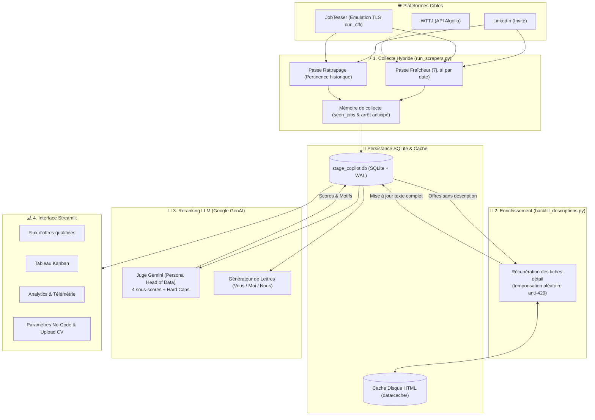

# 🎯 Stage Copilot — Assistant & Pipeline Intelligent de Recherche de Stage

<div align="center">


**Une plateforme d'ingénierie tout-en-un pour sourcer, évaluer par IA et postuler stratégiquement aux meilleurs stages R&D / Data Science.**

[Fonctionnalités](#-fonctionnalités-clés) • [Architecture](#-architecture) • [Installation](#-installation--démarrage-rapide) • [Guide d'utilisation](#-guide-dutilisation) • [Télémétrie & Scraping](#-stratégie-de-collecte-hybride)
[Fonctionnalités](#-fonctionnalités-clés) • [Pipeline & Architecture](#-architecture--pipeline-de-données) • [Installation](#-installation--démarrage-rapide) • [Guide d'utilisation](#-guide-dutilisation) • [Collecte & Backfill](#-stratégie-de-collecte-hybride--résilience) • [Tests](#-tests--qualité-de-code)

</div>

---

## 💡 Pourquoi Stage Copilot ?

Rechercher un stage de fin d'études (PFE) d'élite en Intelligence Artificielle et Data Science est souvent fastidieux : offres noyées dans le bruit (Business Intelligence, support, alternances déguisées), descriptions tronquées sur les agrégateurs et perte de temps sur des candidatures génériques.
Rechercher un stage de fin d'études (PFE) d'excellence en Intelligence Artificielle et Data Science est un parcours semé d'embûches : offres noyées dans le bruit (Business Intelligence, support informatique, alternances déguisées), descriptions absentes des cartes de résultats et perte de temps colossale sur des candidatures génériques.

**Stage Copilot** automatise l'intégralité de la chaîne de valeur :
1. **Collecte hybride et résiliente** des offres sur LinkedIn et JobTeaser (contournement Cloudflare, déduplication stricte et mémoire de collecte anti-doublon).
2. **Enrichissement systématique (Backfill)** des descriptions complètes depuis les pages détail.
3. **Scoring & Reranking 100% LLM** : un persona de *Head of Data* propulsé par **Gemini 2.5 Flash** évalue chaque mission sur une grille d'exigence stricte avec verrous bloquants (*hard caps*).
4. **Générateur instantané de lettres de motivation** ultra-ciblées au style académique formel.
5. **Console de pilotage Streamlit complète** avec vue flux, tableau **Kanban**, **Market Analytics** et panneau de **Paramètres No-Code** pour ajuster son profil et son scraping en direct.
1. **Collecte hybride et résiliente** des offres sur LinkedIn, JobTeaser (intranet EMSE) et Welcome to the Jungle.
2. **Architecture en deux temps (Collecte ➔ Backfill)** : scraping rapide des cartes de résultats, suivi d'un enrichissement progressif des descriptions complètes avec cache disque et temporisation anti-blocage (HTTP 429).
3. **Scoring & Reranking 100% LLM** : un persona de *Head of Data* propulsé par **Gemini (SDK Google GenAI)** évalue la substance scientifique de chaque offre selon une grille d'exigence stricte avec verrous bloquants (*hard caps*).
4. **Générateur instantané de lettres de motivation** ultra-ciblées au style académique formel (*Vous / Moi / Nous*).
5. **Console de pilotage Streamlit complète** avec vue flux, tableau **Kanban**, **Market Analytics**, suivi des tâches asynchrones en temps réel et panneau de **Paramètres No-Code** (upload direct de CV en PDF ou texte).

---

## ✨ Fonctionnalités Clés

### 🧠 1. Évaluation & Reranking 100% LLM (Gemini 2.5 Flash)
- **Persona Head of Data** : Évaluation impitoyable de la substance mathématique et algorithmique de l'offre par rapport au profil candidat.
### 🧠 1. Évaluation & Reranking 100% LLM (Gemini)
- **Persona Head of Data** : Évaluation impartiale de la substance mathématique, algorithmique et logicielle de l'offre en regard du profil candidat.
- **Grille de 4 sous-scores (1 à 5)** :
  - `modeling_depth` : Profondeur algorithmique (du simple SQL/BI jusqu'au Deep Learning, GNN et R&D de pointe).
  - `mentorship_team` : Encadrement (présence de PhD, Staff ML Engineers vs stagiaire isolé).
  - `career_leverage` : Tremplin de carrière (Scale-ups Tier 1, laboratoires de référence vs ESN généraliste).
  - `pfe_compatibility` : Adéquation calendrier et convention de stage 6 mois.
- **Verrous bloquants (*Hard Caps*)** : Plafonnement automatique et immédiat du score en cas d'alternance imposée (note $\le 15$), de mission axée reporting/BI ($\le 20$) ou d'IA superficielle/prompt engineering ($\le 40$).
  - `modeling_depth` : Profondeur algorithmique (du simple reporting SQL jusqu'au Deep Learning, GNN, LLM et R&D de pointe).
  - `mentorship_team` : Encadrement technique (présence de PhD, Staff ML Engineers vs stagiaire isolé).
  - `career_leverage` : Tremplin de carrière (Scale-ups Tier 1, laboratoires de référence CEA/Inria/CNRS vs ESN généraliste).
  - `pfe_compatibility` : Adéquation avec le calendrier école et convention de stage 6 mois.
- **Verrous bloquants (*Hard Caps*)** : Plafonnement automatique et immédiat de la note globale en cas d'alternance imposée ($\le 15$), de mission axée reporting/BI ($\le 20$) ou d'IA superficielle/prompt-engineering ($\le 40$).
- **Modèle configurable** : Prise en charge des modèles Google GenAI via `config.yaml` (`gemini-flash-lite-latest`, `gemini-2.5-flash`, etc.).

### ✍️ 2. Générateur de Lettres de Motivation IA
- **À la demande en un clic** : Bouton `Lettre` disponible sur chaque carte et dans le Kanban.
- **Style académique & complet** : Lettre formelle d'une page respectant la structure classique (*Vous / Moi / Nous*), valorisant vos projets réels en regard des besoins de l'offre.
- **Détection de langue** : Rédige automatiquement en anglais professionnel si l'offre est en anglais, en français soutenu sinon.
- **Édition & Export** : Zone de texte modifiable pour prévisualiser la lettre et la télécharger instantanément en `.txt` ou `.md`.
### ✍️ 2. Générateur de Lettres de Motivation Personnalisées
- **Génération en un clic** : Bouton `✍️ Lettre` accessible sur chaque carte d'offre et dans le Kanban.
- **Structure académique & ciblée** : Rédaction formelle d'une page respectant les trois volets canoniques (*Vous / Moi / Nous*), reliant directement les projets passés du candidat aux verrous techniques de l'entreprise.
- **Détection linguistique automatique** : Rédige nativement en anglais professionnel si l'offre est rédigée en anglais, en français soutenu sinon.
- **Édition & Export direct** : Prévisualisation dans une zone de texte modifiable et téléchargement immédiat en `.txt` ou `.md`.

### 📊 3. Tableau de Bord Multi-Pages (Streamlit)
- **Accueil (`app.py`)** : Bandeau KPI dynamique, flux de cartes enrichies, scores R&D, points forts, alertes et bouton direct `🚀 Postuler ↗`.
- **Kanban (`pages/kanban.py`)** : Suivi visuel de l'avancement de vos candidatures (*Nouveau*, *Postulé*, *Entretien*, *Refusé*, *Ignoré*) modifiable en 1 clic.
- **Télémétrie & Market Analytics (`pages/statistiques.py`)** : Graphique d'évolution temporelle des publications d'offres et observabilité complète des runs de collecte.
- **Pipeline (`pages/pipeline.py`)** : Lancement des collectes et du scoring avec streaming du journal en direct.
### 📊 3. Console Multi-Pages Streamlit
- **Accueil (`app.py`)** : Bandeau KPI dynamique, flux de cartes enrichies, badges technologiques, motifs de rejet ou points forts détectés, et bouton direct `🚀 Postuler ↗`.
- **Kanban (`pages/kanban.py`)** : Gestion du cycle de vie des candidatures (*Nouveau*, *Postulé*, *Entretien*, *Refusé*, *Ignoré*) avec horodatage de candidature.
- **Télémétrie & Market Analytics (`pages/statistiques.py`)** : Graphiques d'évolution temporelle des publications d'offres et observabilité des passes de collecte.
- **Pipeline (`pages/pipeline.py`)** : Lancement asynchrone des collectes, backfill et scoring avec streaming en direct des journaux d'exécution sans figer l'application.
- **Paramètres No-Code (`pages/parametres.py`)** :
  - **Upload de CV** : Déposez directement votre CV en **PDF** ou **texte (.txt)** avec extraction automatique (`pypdf`) et sauvegarde sans toucher au code.
  - **Gestion du Scraping** : Personnalisez les mots-clés de recherche, plafonds et seuils de fraîcheur directement dans l'interface.
  - **Re-notation des offres** : Réévaluez le vivier d'offres d'un coup avec votre nouveau profil CV.
  - **Upload de CV** : Déposez directement votre CV en **PDF** (extraction automatique avec `pypdf`) ou en **texte (.txt)**.
  - **Pilotage du Scraping** : Édition des mots-clés de recherche, quotas et seuils directement depuis l'UI.
  - **Re-notation des offres** : Réévaluation globale du vivier d'offres en un clic après mise à jour du profil.

---

## 🏗️ Architecture
## 🏗️ Architecture & Pipeline de Données

### 🔄 Diagramme de flux de bout en bout



### 📁 Structure du Projet

```
Assistant_recherche_de_stage/
├── app.py                      # Application Streamlit principale (Dashboard & flux d'offres)
├── run_pipeline.py             # Orchestrateur unifié : Collecte → Backfill → Reranking LLM
├── run_scrapers.py             # Moteur de collecte unifié avec arguments CLI
├── backfill_descriptions.py    # Rattrapage automatique des fiches détaillées (LinkedIn/JobTeaser)
├── run_scrapers.py             # Moteur de collecte hybride avec options CLI
├── backfill_descriptions.py    # Rattrapage automatique des descriptions détaillées
├── config.yaml                 # Configuration centrale (scraping, quotas, verrous, base SQLite)
├── requirements.txt            # Dépendances du projet
│
├── pages/                      # Pages de l'interface Streamlit
│   ├── kanban.py               # Tableau Kanban de suivi des candidatures
│   ├── statistiques.py         # Observabilité, télémétrie des passes & Market Analytics
│   ├── pipeline.py             # Déclencheur des scripts de maintenance avec journalisation
│   ├── pipeline.py             # Déclencheur des scripts de maintenance avec streaming des logs
│   └── parametres.py           # Options No-Code (Upload CV PDF/TXT, requêtes, re-notation)
│
├── data/
│   ├── cv_eddy.txt             # Profil candidat de référence (utilisé par le LLM)
│   ├── prompt_rerank.txt       # System instruction du juge LLM (grille et persona)
│   └── stage_copilot.db        # Base de données SQLite persistante
│   ├── stage_copilot.db        # Base de données SQLite persistante (WAL activé)
│   └── cache/                  # Cache disque immuable des pages HTML détaillées
│
├── scrapers/                   # Module de scraping robuste
├── scrapers/                   # Modules de scraping spécialisés
│   ├── base.py                 # Moteur générique de collecte hybride et déduplication
│   ├── manager.py              # Orchestration transverse des sources
│   ├── linkedin.py             # Collecte LinkedIn invité avec filtrage temporel
│   ├── linkedin.py             # Collecte LinkedIn invité (cartes de recherche & page détail)
│   ├── jobteaser.py            # Collecte JobTeaser (impersonation TLS curl_cffi contre Cloudflare)
│   ├── wttj.py                 # Collecte Welcome to the Jungle via API publique Algolia
│   └── known.py                # Gestionnaire d'arrêt anticipé sur offres déjà vues
│
├── src/
│   ├── config.py               # Chargement et sauvegarde dynamique de config.yaml
│   ├── constants.py            # Statuts, seuils, constantes et libellés
│   ├── matching/
│   │   ├── llm_judge.py        # Juge d'évaluation et reranking (Google GenAI SDK)
│   │   └── cover_letter.py     # Générateur de lettres de motivation personnalisées
│   └── storage/
│       └── database.py         # ORM SQLAlchemy (jobs, seen_jobs, scrape_runs, télémétrie)
│
└── tests/                      # Suite de validation automatisée (88 tests)
├── tools/
│   └── probe_sources.py        # Outil d'audit réseau sans état pour sonder les flux sources
│
├── utils/
│   ├── task_manager.py         # Exécution de tâches longues en sous-processus asynchrone
│   ├── components.py           # Composants visuels Streamlit réutilisables
│   └── data.py                 # Utilitaires de manipulation de données
│
└── tests/                      # Suite de validation automatisée (108 tests unitaires & d'intégration)
```

---

## 🔄 Stratégie de Collecte Hybride & Résilience

### 💡 Pourquoi une architecture en deux temps (Collecte ➔ Backfill) ?

> **Le constat technique** :
> Sur **LinkedIn** (endpoint public invité `seeMoreJobPostings`) et **JobTeaser**, les résultats de recherche ne renvoient que des **cartes sommaires** (titre, entreprise, date, lieu, URL). **Aucune description de mission n'est présente dans cette liste**.
>
> Télécharger la page de détail de chaque offre *pendant* la pagination de recherche multiplierait par 10 le nombre d'appels réseau et provoquerait un blocage immédiat par les pare-feux anti-bot (**HTTP 429 Too Many Requests**).
>
> **La solution Stage Copilot** :
> 1. **Collecte rapide** : [run_scrapers.py](run_scrapers.py) indexe les flux en un temps record sans surcharger les serveurs.
> 2. **Backfill résilient** : [backfill_descriptions.py](backfill_descriptions.py) visite ensuite les pages détail à cadence contrôlée, enregistre le texte dans un cache disque persistant ([scrapers/cache.py](scrapers/cache.py)) et met à jour la base SQLite.

### 🎯 La double passe par requête

Chaque requête cible est collectée selon une stratégie à double passe :

| Passe | Tri | Fenêtre temporelle | Arrêt anticipé | Rôle clé |
|---|---|---|---|---|
| **Fraîcheur** | Par date (`sortBy=DD`, `f_TPR`) | 7 jours (configurable) | Oui, dès $N$ offres consécutives déjà vues | Capter les offres fraîchement publiées pour postuler en premier |
| **Rattrapage** | Par pertinence algorithmique | Aucune (historique complet) | Non (parcourt la pagination autorisée) | Récupérer les pépites toujours actives publiées plus tôt |

### 🛡️ Robustesse anti-blocage
- **Mémoire de collecte (`seen_jobs`)** : Mémorise l'ensemble des cartes croisées (y compris celles rejetées pour hors-sujet ou contrat invalide) pour garantir un arrêt anticipé fiable sans boucler indéfiniment.
- **Impersonation TLS (`curl_cffi`)** : Contourne les challenges Cloudflare sur l'intranet JobTeaser grâce à l'émulation d'empreinte de navigateur Chrome.
- **Télémétrie complète** : Chaque passe consigne sa raison exacte d'arrêt (`early_stop`, `window_end`, `quota`, etc.) dans SQLite pour s'assurer qu'aucun flux d'offres n'est manqué.

---

## 🚀 Installation & Démarrage Rapide

### 1. Prérequis
- **Python 3.11 ou 3.12** recommandé.
- Une clé API gratuite [Google AI Studio](https://aistudio.google.com/) pour le modèle Gemini.
- Une clé API gratuite [Google AI Studio](https://aistudio.google.com/) pour propulser le modèle Gemini.

### 2. Cloner le projet & installer les dépendances
```bash
git clone https://github.com/votre-compte/Assistant_recherche_de_stage.git
cd Assistant_recherche_de_stage
git clone https://github.com/eddy-decastro/Assistant_de_recherche_de_stage_IA.git
cd Assistant_de_recherche_de_stage_IA

# Création et activation de l'environnement virtuel
python -m venv .venv
# Sur Windows :
# Sur Windows (PowerShell) :
.\.venv\Scripts\activate
# Sur Linux/macOS :
source .venv/bin/activate

# Installation des paquets
# Installation des dépendances
pip install -r requirements.txt
```

### 3. Configurer les clés d'API (`.env`)
Créez un fichier `.env` à la racine du projet (en vous basant sur `.env.example`) :

```env
# Clé obligatoire pour le scoring des offres et les lettres de motivation
# Clé obligatoire pour le scoring des offres et la génération des lettres
GEMINI_API_KEY=AIzaSy...

# Optionnel : cookies de session pour débloquer JobTeaser (contournement Cloudflare)
# Optionnel : cookies de session pour débloquer JobTeaser si Cloudflare s'active
JOBTEASER_COOKIES="cf_clearance=...; remember_user_token=..."
```

---

## 💻 Guide d'utilisation

### 1. Lancer l'interface Web
### 1. Lancer l'interface Web Streamlit
```bash
streamlit run app.py
```
L'interface s'ouvre dans votre navigateur (`http://localhost:8501`). Vous pouvez :
- Consulter et trier vos offres par pertinence R&D.
- Postuler directement via `🚀 Postuler ↗`.
- Générer et exporter une lettre de motivation personnalisée via `✍️ Lettre`.
- Gérer vos statuts dans l'onglet **Kanban**.
- Uploader votre propre CV (PDF ou texte) dans l'onglet **Paramètres**.

### 2. Exécuter le Pipeline complet en une commande
Pour lancer automatiquement la collecte de nouvelles offres, l'enrichissement des descriptions et le scoring Gemini :
### 2. Exécuter le Pipeline complet en ligne de commande
Pour exécuter automatiquement la chaîne complète (Collecte ➔ Backfill ➔ Reranking Gemini) :

```bash
python run_pipeline.py
```
*(Vous pouvez également le déclencher depuis le bouton dédié dans l'onglet Streamlit **Pipeline**).*
*(Vous pouvez également déclencher et suivre ce pipeline en direct depuis l'onglet **Pipeline** de l'interface Streamlit).*

---
### 3. Commandes CLI modulaires

## 🔄 Stratégie de Collecte Hybride
```bash
# Lancer uniquement la collecte LinkedIn en mode fraîcheur
python run_scrapers.py --source linkedin --mode freshness

Chaque requête cible est collectée selon une stratégie à double passe :
# Rattraper 20 descriptions manquantes avec temporisation de 3 secondes
python backfill_descriptions.py --limit 20 --sleep 3

| Passe | Tri | Fenêtre | Arrêt anticipé | Rôle |
|---|---|---|---|---|
| **Fraîcheur** | Par date (`sortBy=DD`, `f_TPR`) | 7 jours (configurable) | Oui, dès $N$ offres consécutives déjà en base | Capter les offres fraîchement publiées pour postuler en premier |
| **Rattrapage** | Par pertinence algorithmique | Aucune (historique) | Non (parcourt la pagination) | Récupérer les pépites toujours actives publiées plus tôt |
# Reranker les 50 meilleures offres avec le LLM sans relancer de collecte
python run_scrapers.py --no-collect --trigger-rerank --top-rerank 50

### Résilience et Anti-Blocage
- **Mémoire de collecte (`seen_jobs`)** : Mémorise l'ensemble des cartes croisées (y compris celles rejetées pour hors-sujet ou contrat invalide) pour garantir un arrêt anticipé fiable sans boucles infinies.
- **Impersonation TLS (`curl_cffi`)** : Contourne les challenges Cloudflare sur l'intranet JobTeaser grâce à l'émulation d'empreinte de navigateur Chrome.
- **Télémétrie complète** : Chaque passe consigne sa raison exacte d'arrêt (`early_stop`, `window_end`, `quota`, etc.) dans SQLite pour s'assurer qu'aucun flux d'offres n'est manqué.
# Auditer les réponses et tris réseau de LinkedIn et JobTeaser
python tools/probe_sources.py --source linkedin --query "Stage Machine Learning"
```

---

## 🧪 Tests & Qualité de Code

Le projet dispose d'une suite de tests complète couvrant le scraping, la persistance base de données, la logique de reranking, le générateur de lettres de motivation et les composants Streamlit :
Le projet dispose d'une suite de validation automatisée couvrant les scrapers, le cache, l'ORM base de données, la logique de reranking LLM, le générateur de lettres et les composants Streamlit :

```bash
python -m pytest tests/
```
```text
======================== 88 passed in 8.52s ========================
============================= test session starts =============================
platform win32 -- Python 3.12, pytest-9.1.1
collected 108 items

tests/test_app.py ............                                           [ 11%]
tests/test_bridge.py .                                                   [ 12%]
tests/test_cleanup.py ........                                           [ 19%]
tests/test_cli.py .........                                              [ 27%]
tests/test_cover_letter.py ....                                          [ 31%]
tests/test_database.py .........                                         [ 39%]
tests/test_enrichment.py ...........                                     [ 50%]
tests/test_hybrid_collection.py ................                         [ 64%]
tests/test_llm_judge.py .........                                        [ 73%]
tests/test_scorer.py ..                                                  [ 75%]
tests/test_scrapers.py ..................                                [ 91%]
tests/test_task_manager.py .........                                     [100%]

======================== 108 passed in ~1m18s ========================
```

---

## 📜 Licence & Auteur

Projet développé avec passion par **Eddy** (Élève-ingénieur aux Mines de Saint-Étienne).  
Distribué sous licence MIT. N'hésitez pas à forker et à adapter les filtres à votre profil !
Distribué sous licence MIT. N'hésitez pas à forker et à adapter les filtres à votre propre recherche de stage !
