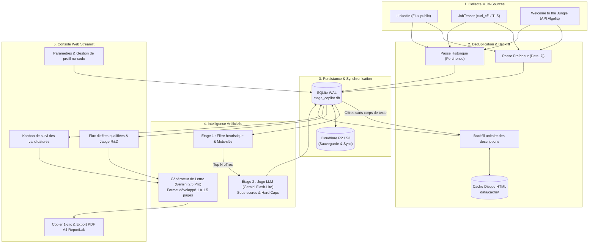

# Stage Copilot — Pipeline d'Agrégation, de Reranking LLM & de Candidature IA

<div align="center">

[](https://recherche-de-stage-ia.streamlit.app/)


%20%2B%20R2-003B57?logo=sqlite&logoColor=white)


**Plateforme complète d'ingénierie pour sourcer, qualifier par IA et générer des candidatures sur mesure pour les stages de fin d'études (PFE) en Data Science, Machine Learning et R&D.**

🌐 **Application en ligne sécurisée :** [recherche-de-stage-ia.streamlit.app](https://recherche-de-stage-ia.streamlit.app/) *(accès privé authentifié)*

[Vue d'ensemble](#-vue-densemble) • [Architecture](#-architecture--pipeline-de-données) • [Générateur de Lettres IA](#-générateur-de-lettres-de-motivation-gemini-25-pro) • [Scoring à Deux Étages](#-système-de-scoring-à-deux-étages) • [Console Streamlit](#-console-de-pilotage-streamlit) • [Déploiement Cloud & R2](#-déploiement-cloud--architecture-hybride) • [Tests](#-tests--qualité-de-code) • [Installation](#-installation--démarrage-rapide)

</div>

---

## 📌 Vue d'ensemble

La recherche d'un stage de fin d'études (PFE) d'excellence en Machine Learning et R&D souffre d'un bruit massif sur les plateformes généralistes :
1. **Titres trompeurs** : Missions de support ou de Business Intelligence (Power BI, SQL basique) présentées sous l'intitulé « Data Scientist ».
2. **Alternances masquées** : Contrats d'apprentissage ou de professionnalisation non signalés dans l'intitulé.
3. **Temps perdu en candidature** : Rédiger des lettres de motivation personnalisées et argumentées prend des heures par entreprise.

**Stage Copilot** résout l'ensemble de la chaîne :
- **Collecte multi-sources hybride** : Scraping asynchrone sur LinkedIn, JobTeaser et Welcome to the Jungle.
- **Scoring à deux étages avec Juge LLM** : Pré-filtrage déterministe local suivi d'un reranking approfondi par un persona *Head of Data* (Gemini).
- **Rédaction de lettres d'excellence (Gemini 2.5 Pro)** : Génération de lettres complètes de 1 à 1,5 pages, 100 % rédigées sans aucun placeholder, prêtes à être copiées en 1 clic ou exportées en PDF multi-pages.
- **Tableau de bord interactif & Kanban** : Suivi des candidatures (*À postuler*, *Postulé*, *Entretien*, *Archivé*) synchronisé dans le Cloud via SQLite et Cloudflare R2.

---

## 🏗️ Architecture & Pipeline de Données



---

## ✍️ Générateur de Lettres de Motivation (Gemini 3.8 Flash)

Pour transformer les offres qualifiées en entretiens réels, l'application intègre un moteur de rédaction sur-mesure alimenté par le modèle de pointe **Gemini 3.8 Flash**.

```
┌────────────────────────────────────────────────────────────────────────┐
│  LETTRE DE MOTIVATION PERSONNALISÉE                                    │
│  Poste : Stage R&D Deep Learning — Mistral AI                          │
├────────────────────────────────────────────────────────────────────────┤
│  Objet : Candidature au stage de fin d'études — Stage R&D Deep Learning│
│                                                                        │
│  Madame, Monsieur,                                                     │
│                                                                        │
│  [Paragraphe 1 : Accroche ciblée & Défis techniques de l'entreprise]  │
│  [Paragraphe 2 : Triple formation d'excellence Maths / IA]             │
│  [Paragraphe 3 & 4 : 2 réalisations R&D en miroir avec le poste]       │
│  [Paragraphe 5 : Disponibilité PFE 6 mois avril 2027 & Collaboration]  │
│                                                                        │
│  Eddy DE CASTRO                                                        │
│  Élève-ingénieur Mines de Saint-Étienne — Double diplôme M2 MAEA       │
│  06 98 82 44 85 | eddyprepa123@gmail.com | LinkedIn | GitHub           │
├────────────────────────────────────────────────────────────────────────┤
│  Consigne optionnelle : [ ex: Insiste sur les Transformers... ]        │
│  [📋 Copier la lettre]   [📄 Télécharger (.pdf)]   [🔄 Régénérer]      │
└────────────────────────────────────────────────────────────────────────┘
```

### Caractéristiques clés :
1. **Format développé académique & percutant (1 à 1,5 pages)** :
   - Calibré entre **500 et 650 mots** avec une argumentation technique rigoureuse.
   - **Règle absolue Zéro Crochet** : Aucun `[...]` ou placeholder non résolu. Tout est rédigé et prêt à l'emploi.
2. **Valorisation du triple cursus** :
   - Double diplôme **Master 2 Mathématiques en Action (MAEA, Mines Saint-Étienne / ENS Lyon)** et diplôme d'ingénieur **IMT Mines Alès** (IA & Data Science).
   - **Licence 3 de Mathématiques Générales à l'Université de Montpellier** menée en parallèle de l'école d'ingénieurs (démontrant une capacité de travail exceptionnelle et une maîtrise poussée en algèbre linéaire, optimisation convexe, probabilités et modélisation stochastique).
3. **Mise en miroir des projets concrets** :
   - Stage R&D à l'**UPC Barcelone** (Graph ML, attaques différentiables PyTorch BPDA/FGSM, validation statistique par bootstrap).
   - Projets d'ingénierie : **MedStay-CI** (quantification d'incertitude conforme certifiée à 89,9 %, régression quantile LightGBM, conteneurisation Docker, 124 tests) ou **CinéFilm IA** (recherche sémantique vectorielle bi-encodeurs E5-Large sous 100 ms).
4. **Export PDF multi-pages A4 (ReportLab)** :
   - Pagination dynamique à deux passes via `NumberedCanvas` (*Page X / Y* en bas de page).
   - Rendu typographique épuré (palette bleu marine `#1E3A8A` et gris ardoise `#1E293B`).
   - Nom de fichier normalisé : **`Lettre de motivation Eddy De Castro - {Entreprise}.pdf`**.
5. **Ergonomie en 1 clic** :
   - Bouton **📋 Copier la lettre** avec feedback visuel vert instantané pour coller directement dans Welcome to the Jungle, JobTeaser ou LinkedIn.
   - Champ de **consigne libre** pour orienter la régénération (ex. *"Insiste sur la vision par ordinateur"*).
   - Compteur de mots et de caractères en temps réel.

---

## 🎯 Système de Scoring à Deux Étages

Le filtrage en entonnoir concilie puissance de sélection et respect strict des quotas d'API :

```
             [ Ensemble des offres collectées (600+) ]
                                │
                                ▼
         ┌──────────────────────────────────────────────┐
         │  ÉTAGE 1 : Filtrage Local & Heuristique      │  Coût API : 0 €
         │  - Mots-clés d'exclusion (BI, support, com)  │  Vitesse : immédiate
         │  - Filtre contrat (PFE 6 mois vs alternance) │
         │  - Détection scale-ups Tier 1 & labos R&D    │
         └──────────────────────────────────────────────┘
                                │
                      (Top N pré-sélectionné)
                                │
                                ▼
         ┌──────────────────────────────────────────────┐
         │  ÉTAGE 2 : Reranking LLM (Gemini Flash-Lite) │  Rate limit adaptatif
         │  - Persona Head of Data                      │  Sous-scores ciblés
         │  - Verrous bloquants (Hard Caps)             │  Synthèse technique
         └──────────────────────────────────────────────┘
                                │
                                ▼
                  [ Flux Qualifié & Tableau Kanban ]
```

### Grille d'évaluation du Juge LLM :
- **4 sous-scores normalisés** :
  - `modeling_depth` : Densité algorithmique et mathématique du projet.
  - `mentorship_team` : Niveau technique de l'équipe d'accueil (Staff Engineers, PhDs).
  - `career_leverage` : Tremplin de carrière pour un futur ingénieur de recherche / data scientist.
  - `pfe_compatibility` : Adéquation avec les exigences académiques d'un PFE de 6 mois.
- **Hard Caps automatiques** : Plafonnement direct de la note si le poste est en réalité une alternance cachée ($\le 15/100$), du reporting décisionnel ($\le 20/100$) ou de l'intégration de wrappers sans modélisation ($\le 40/100$).

---

## 💻 Console de Pilotage Streamlit

L'interface multi-pages couvre l'intégralité du workflow :

| Page | Fonctionnalités |
|---|---|
| **Flux d'offres (`app.py`)** | Liste des offres triées par score R&D, filtres avancés (score, source, localisation, contrat), jauges de score et modale de lettre de motivation. |
| **Kanban (`pages/kanban.py`)** | Suivi visuel des candidatures en 5 colonnes (*À postuler*, *Postulé*, *Entretien*, *Refusé*, *Archivé*) avec date d'envoi mémorisée. |
| **Statistiques (`pages/statistiques.py`)** | Analytics du marché (distribution des technologies demandées, salaires observés, répartition géographique) et télémétrie des passes de scraping. |
| **Pipeline (`pages/pipeline.py`)** | Déclenchement manuel ou asynchrone des passes de collecte et de reranking avec streaming des logs en temps réel. |
| **Paramètres (`pages/parametres.py`)** | Dépôt de CV (PDF/TXT), mise à jour no-code des coordonnées candidat (téléphone, email, profils) et édition des critères de recherche. |

---

## ☁️ Déploiement Cloud & Architecture Hybride

Stage Copilot fonctionne en architecture hybride pour concilier contournement anti-bot et persistance 24h/24 :

1. **Collecte locale** : Le scraping lourd s'exécute sur votre machine locale (IP résidentielle) pour contourner les verrous anti-datacenters de LinkedIn et JobTeaser.
2. **Persistance Cloudflare R2** : La base SQLite (`stage_copilot.db`) est automatiquement sauvegardée sur un bucket object storage S3-compatible (Cloudflare R2, gratuit jusqu'à 10 Go).
3. **Tableau de bord Streamlit Cloud / Render** : L'interface web est déployée en continu sur le Cloud, sécurisée par une authentification par mot de passe (`APP_PASSWORD`).

```bash
# Workflow de synchronisation :
python scripts/sync_db.py --pull    # Récupérer les statuts modifiés depuis le smartphone
python run_pipeline.py              # Collecter et qualifier les nouvelles offres en local
python scripts/sync_db.py --push    # Pousser la base à jour vers le Cloud
```

---

## 🧪 Tests & Qualité de Code

Le projet est validé par une suite complète de **122 tests automatisés** couvrant les scrapers, les bases de données, les algorithmes de scoring, le générateur de lettres et le compilateur PDF :

```bash
python -m pytest tests/
```

```text
============================= test session starts =============================
platform win32 -- Python 3.12, pytest-9.1.1
collected 122 items

tests/test_app.py .............                                          [ 10%]
tests/test_auth.py ..                                                    [ 12%]
tests/test_bridge.py .                                                   [ 13%]
tests/test_cleanup.py ........                                           [ 19%]
tests/test_cli.py .........                                              [ 27%]
tests/test_cloud_storage.py .......                                      [ 32%]
tests/test_cover_letter.py .........                                     [ 39%]
tests/test_database.py .........                                         [ 46%]
tests/test_enrichment.py ...........                                     [ 55%]
tests/test_hybrid_collection.py ................                         [ 68%]
tests/test_llm_judge.py .........                                        [ 76%]
tests/test_scorer.py ..                                                  [ 77%]
tests/test_scrapers.py ..................                                [ 92%]
tests/test_task_manager.py .........                                     [100%]

======================= 122 passed in ~35s =======================
```

---

## 🚀 Installation & Démarrage Rapide

### 1. Cloner le dépôt et configurer l'environnement
```bash
git clone https://github.com/eddy-decastro/Assistant_de_recherche_de_stage_IA.git
cd Assistant_de_recherche_de_stage_IA

python -m venv .venv

# Windows (PowerShell) :
.\.venv\Scripts\activate
# Linux / macOS :
source .venv/bin/activate

pip install -r requirements.txt
```

### 2. Variables d'environnement (`.env`)
Créez un fichier `.env` à la racine à partir de `.env.example` :
```env
# Clé API Google AI Studio (gratuite) pour Gemini
GEMINI_API_KEY=AIzaSy...

# Mot de passe d'accès pour l'interface Streamlit (local & cloud)
APP_PASSWORD=votre_mot_de_passe_secret

# (Optionnel) Identifiants Cloudflare R2 pour la persistance cloud
R2_ACCOUNT_ID=...
R2_ACCESS_KEY_ID=...
R2_SECRET_ACCESS_KEY=...
R2_BUCKET_NAME=...
```

### 3. Lancer l'application
```bash
streamlit run app.py
```
L'interface s'ouvre automatiquement sur `http://localhost:8501`.

### 4. Lancer le pipeline complet en CLI
```bash
python run_pipeline.py
```

---

## 📜 Licence & Auteur

Projet distribué sous licence **MIT**.  
Développé par **[Eddy DE CASTRO](https://www.linkedin.com/in/eddy-de-castro/)** — Élève-ingénieur aux Mines de Saint-Étienne (M2 Mathématiques en Action / IMT Mines Alès).
