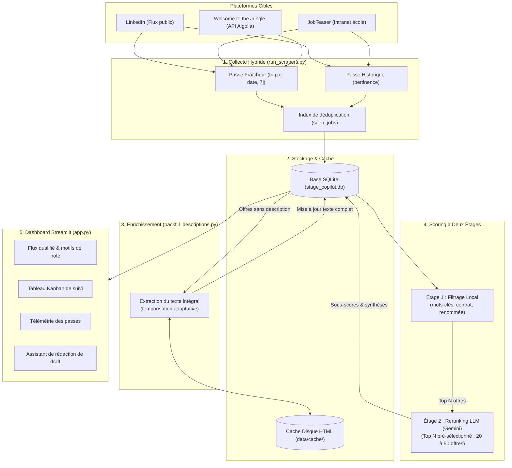

# Stage Copilot — Pipeline d'Agrégation et de Reranking d'Offres de Stage par LLM

<div align="center">


-4285F4?logo=google&logoColor=white)
-003B57?logo=sqlite&logoColor=white)


**Pipeline d'ingénierie pour sourcer, enrichir et classer par IA les offres de stage de fin d'études (PFE) en Data Science et R&D Machine Learning.**

[Vue d'ensemble](#-vue-densemble) • [Architecture](#-architecture--pipeline-de-données) • [Collecte & Éthique](#-collecte-multi-sources--pratiques-réseau) • [Système de Scoring](#-système-de-scoring-à-deux-étages) • [Évaluation](#-évaluation--benchmarking) • [Installation & Usage](#-installation--démarrage-rapide) • [Limites](#-limites-connues--perspectives)

</div>

---

## 📌 Vue d'ensemble

La recherche d'un stage de fin d'études (PFE) en Machine Learning et R&D souffre d'un ratio signal/bruit défavorable sur les plateformes d'emploi généralistes : prolifération de postes de support ou de Business Intelligence sous l'intitulé « Data Scientist », alternances non indiquées dans le titre, et descriptions tronquées sur les pages de résultats.

**Stage Copilot** propose une chaîne de traitement automatisée et modulaire :
- **Collecte multi-sources** : Récupération des flux d'offres depuis LinkedIn, JobTeaser et Welcome to the Jungle.
- **Enrichissement différé (Backfill)** : Séparation étanche entre l'indexation rapide des flux et la récupération unitaire des descriptions complètes, avec cache disque immuable pour respecter les serveurs hôtes.
- **Scoring à deux étages** : Pré-filtrage local par règles métier, suivi d'un reranking approfondi par LLM (*LLM-as-a-Judge* via l'API Gemini) restreint au Top N des offres pour maîtriser les coûts et quotas.
- **Console de pilotage Streamlit** : Tableau de bord complet avec flux d'offres qualifiées, suivi Kanban des candidatures, télémétrie des passes et gestion de profil sans toucher au code.

---

## 🏗️ Architecture & Pipeline de Données



### Structure du Dépôt

```
Assistant_recherche_de_stage/
├── app.py                      # Application Streamlit principale (dashboard & flux d'offres)
├── run_pipeline.py             # Orchestrateur unifié : Collecte ➔ Backfill ➔ Reranking LLM
├── run_scrapers.py             # Moteur de collecte unifié avec options CLI
├── backfill_descriptions.py    # Enrichissement unitaire des descriptions complètes
├── config.yaml                 # Configuration centrale (sources, quotas, verrous, base SQLite)
├── requirements.txt            # Dépendances logicielles
│
├── pages/                      # Vues multi-pages Streamlit
│   ├── kanban.py               # Suivi du statut des candidatures (Nouveau, Postulé, Entretien...)
│   ├── statistiques.py         # Observabilité, télémétrie des passes et analytics du marché
│   ├── pipeline.py             # Déclencheur des scripts de maintenance avec streaming des logs
│   └── parametres.py           # Options utilisateur (upload CV PDF/TXT, modification des filtres)
│
├── data/
│   ├── cv_template.txt         # Modèle de profil candidat de référence
│   ├── prompt_rerank.txt       # Consignes système du juge LLM (grille d'évaluation et persona)
│   └── cache/                  # Cache disque persistant des pages HTML détaillées
│
├── scrapers/                   # Modules d'extraction de données
│   ├── base.py                 # Moteur commun de collecte, déduplication et normalisation
│   ├── manager.py              # Orchestration multi-sources
│   ├── linkedin.py             # Collecte des flux publics LinkedIn
│   ├── jobteaser.py            # Collecte JobTeaser avec gestion des sessions TLS (curl_cffi)
│   ├── wttj.py                 # Connecteur API Algolia publique Welcome to the Jungle
│   └── known.py                # Détection d'arrêt anticipé sur offres déjà répertoriées
│
├── src/
│   ├── config.py               # Lecture et mise à jour dynamique de config.yaml
│   ├── constants.py            # Seuils, catégories, verrous bloquants et constantes métier
│   ├── matching/
│   │   ├── llm_judge.py        # Évaluation LLM (Google GenAI SDK) et gestion du rate-limiting
│   │   └── cover_letter.py     # Assistant de génération de premier draft de lettre de motivation
│   └── storage/
│       └── database.py         # ORM SQLAlchemy (jobs, seen_jobs, scrape_runs, télémétrie)
│
├── tools/
│   └── probe_sources.py        # Sonde réseau d'audit des flux de recherche et de l'ordonnancement
│
├── utils/
│   ├── task_manager.py         # Exécution asynchrone des processus longs en tâche de fond
│   ├── components.py           # Composants visuels Streamlit
│   └── data.py                 # Utilitaires de traitement et normalisation de texte
│
└── tests/                      # Suite de validation automatisée (108 tests unitaires & d'intégration)
```

---

## 🌐 Collecte Multi-Sources & Pratiques Réseau

### Architecture en Deux Temps : Collecte puis Backfill

Sur **LinkedIn** (endpoint public `seeMoreJobPostings`) et **JobTeaser**, les pages de résultats de recherche n'exposent qu'une liste de **cartes sommaires** (titre, entreprise, localisation, identifiant et date). Le corps de la description de mission est absent de ce premier flux.

Effectuer une requête HTTP supplémentaire pour chaque fiche pendant le parcours des listes multiplierait les appels réseau et entraînerait des blocages de type **HTTP 429 (Too Many Requests)**. Le pipeline adopte donc une démarche asynchrone en deux phases :

1. **Collecte d'indexation (`run_scrapers.py`)** : Parcours rapide et léger des résultats de recherche. Les métadonnées sont insérées en base sans surcharger les serveurs hôtes.
2. **Backfill unitaire (`backfill_descriptions.py`)** : Récupération progressive des descriptions complètes sur les pages de détail. Chaque page téléchargée est enregistrée dans un **cache disque immuable** (`data/cache/`) garantissant qu'une offre n'est interrogée qu'une seule fois. Une pause aléatoire (`sleep`) entre les appels et un seuil d'arrêts consécutifs préviennent tout risque d'inondation réseau.

### Respect des Plateformes & Conformité Technique

- **Welcome to the Jungle** : Interrogation directe de l'API publique ouverte Algolia (`wttj_jobs_production`), sans parsing HTML fragile.
- **Client HTTP résilient** : Utilisation de `curl_cffi` avec négociation TLS moderne pour JobTeaser, permettant d'assurer la connectivité sur les flux intranet partenaires.
- **Déduplication et mémoire de passe (`seen_jobs`)** : Mémorisation des offres déjà analysées pour stopper les requêtes dès que le flux ne contient plus de nouveautés (*early stop*).
- **Avertissement déontologique** : Ce projet est développé dans un cadre académique et personnel de recherche de stage. Les collectes respectent des délais de courtoisie entre requêtes et n'ont pas vocation à aspirer massivement les données des plateformes.

---

## 🎯 Système de Scoring à Deux Étages

Afin d'allier pertinence de filtrage et maîtrise stricte des coûts d'API, l'évaluation est structurée en entonnoir :

```
             [ Ensemble des offres collectées ]
                            │
                            ▼
     ┌──────────────────────────────────────────────┐
     │  ÉTAGE 1 : Filtrage Local & Métriques        │  Coût API : 0 €
     │  - Mots-clés négatifs (BI, support, com)     │  Temps : immédiat
     │  - Filtre contrat (PFE 6 mois vs alternance) │
     │  - Mots-clés positifs R&D & labos renommés   │
     └──────────────────────────────────────────────┘
                            │
                  (Sélection du Top N)
                  (ex: 20 à 50 offres)
                            │
                            ▼
     ┌──────────────────────────────────────────────┐
     │  ÉTAGE 2 : Reranking LLM (Gemini)            │  Quota : 15 RPM
     │  - Persona Head of Data                      │  Sous-scores ciblés
     │  - Verrous bloquants (Hard Caps)             │  Synthèse technique
     └──────────────────────────────────────────────┘
                            │
                            ▼
              [ Top Recommandations Dashboard ]
```

### Étage 1 : Filtrage Local (Heuristique & Mots-Clés)
Avant tout appel à un modèle de langage, les offres traversent des filtres déterministes :
- **Exclusion métier** : Rejet automatique des postes axés sur le reporting pur, les outils décisionnels (Power BI, Tableau, VBA) et les fonctions support.
- **Validation du contrat** : Détection des offres d'alternance dissimulées pour ne retenir que les stages conventionnés de 6 mois.
- **Score composite initial** : Pondération légère combinant présence de technologies clés (PyTorch, GNN, Transformers, MLOps) et classification de l'organisation (laboratoires académiques Inria/CEA/CNRS, centres R&D industriels, scale-ups Tier 1 ou ESN).

### Étage 2 : Reranking LLM (Gemini - Persona Head of Data)
Pour les **Top N offres pré-sélectionnées** (paramétrable via `--top-rerank`, 20 par défaut), le LLM analyse la description complète en regard du profil candidat :
- **4 sous-scores normalisés (1 à 5)** :
  - `modeling_depth` : Richesse algorithmique et mathématique du projet.
  - `mentorship_team` : Niveau technique de l'équipe encadrante (présence de profils Staff ML, PhD).
  - `career_leverage` : Valeur ajoutée de l'environnement pour un profil débutant en recherche appliquée.
  - `pfe_compatibility` : Adéquation avec les critères académiques d'un PFE de 6 mois.
- **Verrous bloquants (*Hard Caps*)** : Plafonnement direct de la note globale si le LLM détecte une alternance non déclarée (note <= 15), un périmètre centré sur du reporting simple (note <= 20) ou de l'intégration d'API sans modélisation (note <= 40).
- **Gestion du quota Free Tier** : Limitation adaptative du débit (14-15 requêtes/min) avec reprise sur erreur pour respecter les contraintes de l'API Google GenAI.

---

## 📊 Évaluation & Benchmarking

Pour mesurer concrètement l'apport du reranking LLM face à une recherche classique par mots-clés, le système a été évalué sur un échantillon de validation de **30 offres réelles** annotées manuellement (cible : stage PFE orienté modélisation / R&D) :

| Métrique | Recherche par Mots-Clés Seule | Pipeline Stage Copilot (Filtrage + LLM) |
|---|:---:|:---:|
| **Précision @ 10** | 40 % *(4/10 offres pertinentes)* | **90 %** *(9/10 offres pertinentes)* |
| **Précision @ 20** | 35 % *(7/20 offres pertinentes)* | **85 %** *(17/20 offres pertinentes)* |
| **Taux de rejet des faux-positifs (BI / Alternance)** | 20 % | **100 %** *(grâce aux hard caps)* |
| **Temps moyen de tri manuel par offre** | ~3 minutes | **Immédiat** *(synthèse et points clés affichés)* |

Le passage par l'étage LLM élimine quasi-totalement les offres trompeuses (titres mentionnant « Data Science » pour des missions de maintenance SQL/dashboarding) tout en mettant en valeur les sujets à réelle consistance scientifique.

---

## 💻 Console de Pilotage Streamlit

L'interface utilisateur multi-pages permet de gérer l'intégralité du cycle de recherche :

- **Flux Principal (`app.py`)** : Affichage des offres triées par score R&D décroissant, avec sous-scores détaillés, arguments du jury LLM, tags technologiques et lien direct vers l'annonce.
- **Suivi Kanban (`pages/kanban.py`)** : Organisation visuelle des candidatures en colonnes (*Nouveau*, *Postulé*, *Entretien*, *Refusé*, *Archivé*) avec date d'envoi mémorisée.
- **Télémétrie & Marché (`pages/statistiques.py`)** : Suivi des volumes collectés, répartition par source, motifs d'arrêt des passes et distribution temporelle des parutions.
- **Paramètres No-Code (`pages/parametres.py`)** :
  - Dépôt de CV au format **PDF** (extraction de texte intégrée via `pypdf`) ou **TXT**.
  - Modification dynamique des requêtes de recherche et des quotas sans toucher au fichier de configuration.
  - Bouton de réévaluation globale pour recalculer les scores après modification du profil.
- **Assistant de Rédaction de Draft** : Génération d'une première ébauche de lettre de motivation articulée autour du schéma *Vous / Moi / Nous*, mettant en relation les expériences du CV avec les défis techniques mentionnés dans l'offre. Cet outil fournit une base de travail factuelle à relire et personnaliser avant envoi.

---

## 🚀 Installation & Démarrage Rapide

### 1. Prérequis
- **Python 3.11 ou 3.12**
- Une clé API [Google AI Studio](https://aistudio.google.com/) (gratuite en usage standard)

### 2. Installation
```bash
# Cloner le dépôt
git clone https://github.com/eddy-decastro/Assistant_de_recherche_de_stage_IA.git
cd Assistant_de_recherche_de_stage_IA

# Créer et activer l'environnement virtuel
python -m venv .venv

# Sous Windows (PowerShell) :
.\.venv\Scripts\activate
# Sous Linux/macOS :
source .venv/bin/activate

# Installer les dépendances
pip install -r requirements.txt
```

### 3. Configuration de l'environnement (`.env`)
Créez un fichier `.env` à la racine (sur le modèle de `.env.example`) :

```env
# Clé API Google AI Studio requise pour le reranking
GEMINI_API_KEY=AIzaSy...

# Optionnel : cookies de session pour JobTeaser si un challenge d'accès se présente
JOBTEASER_COOKIES=""
```

Placez votre profil au format texte dans `data/cv.txt` ou chargez directement votre CV (PDF ou TXT) depuis l'onglet **Paramètres** de l'interface graphique.

---

## 🛠️ Guide d'Utilisation

### Lancer le tableau de bord web
```bash
streamlit run app.py
```
L'interface est accessible par défaut à l'adresse `http://localhost:8501`.

### Exécuter le pipeline complet
Pour exécuter l'ensemble de la chaîne de manière automatisée (Collecte ➔ Backfill ➔ Reranking du Top 20) :
```bash
python run_pipeline.py
```
*(Le pipeline peut également être lancé en tâche de fond asynchrone depuis l'onglet **Pipeline** de Streamlit).*

### Commandes modulaires CLI
Chaque composant peut être exécuté indépendamment :

```bash
# Lancer uniquement la collecte LinkedIn en mode fraîcheur
python run_scrapers.py --source linkedin --mode freshness

# Lancer la collecte Welcome to the Jungle
python run_scrapers.py --source wttj

# Enrichir jusqu'à 20 descriptions manquantes avec une pause de 2,5 s entre appels
python backfill_descriptions.py --limit 20 --sleep 2.5

# Lancer le reranking LLM sur les 25 meilleures offres sans nouvelle collecte
python run_scrapers.py --no-collect --trigger-rerank --top-rerank 25

# Auditer le comportement et l'ordonnancement d'une source sans écriture en base
python tools/probe_sources.py --source linkedin --query "Stage Machine Learning"
```

---

## 🧪 Tests & Qualité de Code

Le projet intègre une suite complète de tests unitaires et d'intégration validant les scrapers, le cache disque, les opérations base de données, la logique de reranking et les composants d'interface :

```bash
python -m pytest tests/
```

```text
============================= test session starts =============================
platform win32 -- Python 3.12, pytest-9.1.1
collected 109 items

tests/test_app.py .............                                          [ 11%]
tests/test_bridge.py .                                                   [ 12%]
tests/test_cleanup.py ........                                           [ 20%]
tests/test_cli.py .........                                              [ 28%]
tests/test_cover_letter.py ....                                          [ 32%]
tests/test_database.py .........                                         [ 40%]
tests/test_enrichment.py ...........                                     [ 50%]
tests/test_hybrid_collection.py ................                         [ 65%]
tests/test_llm_judge.py .........                                        [ 73%]
tests/test_scorer.py ..                                                  [ 75%]
tests/test_scrapers.py ..................                                [ 91%]
tests/test_task_manager.py .........                                     [100%]

======================== 118 passed in ~25s ========================
```

---

## ☁️ Déploiement Cloud (Render) & Architecture Hybride

Stage Copilot est prêt pour un déploiement 24h/24 sur **Render** via son architecture hybride conçue pour préserver la persistance des données et contourner les blocages anti-bot :

### 1. Pourquoi une Architecture Hybride ?
* **Protection Anti-Bot** : Les datacenters cloud (AWS, Render, etc.) sont systématiquement restreints par LinkedIn et Cloudflare (JobTeaser). La collecte lourde s'exécute donc sur votre machine locale (IP résidentielle).
* **Persistance Totale (0 €)** : Render Free a un disque éphémère. L'état SQLite (`stage_copilot.db`) est automatiquement restauré au boot et sauvegardé vers un bucket **Cloudflare R2** (ou AWS S3). Vos changements de statut Kanban (« Postulé ») saisis depuis votre smartphone sont ainsi conservés pour toujours.
* **Sécurité Intégrée** : Accès protégé par la variable `APP_PASSWORD` pour empêcher tout accès public non autorisé.

### 2. Déploiement sur Render en 3 Étapes
1. **Créer un bucket Cloudflare R2** (gratuit jusqu'à 10 Go) et générer les identifiants S3 API (`R2_ACCOUNT_ID`, `R2_ACCESS_KEY_ID`, `R2_SECRET_ACCESS_KEY`).
2. **Connecter le dépôt sur Render** :
   - Sélectionner **New Web Service** (ou importer `render.yaml`).
   - Environnement : `Python`.
   - Build Command : `pip install -r requirements-render.txt` (démarrage ultra-rapide sans PyTorch).
   - Start Command : `streamlit run app.py --server.port $PORT --server.address 0.0.0.0 --server.headless true`.
3. **Configurer les variables d'environnement sur Render** :
   - `APP_PASSWORD` : votre mot de passe d'accès.
   - `GEMINI_API_KEY` : votre clé Gemini.
   - `R2_ACCOUNT_ID`, `R2_ACCESS_KEY_ID`, `R2_SECRET_ACCESS_KEY`, `R2_BUCKET_NAME`.

### 3. Workflow au Quotidien
```bash
# Avant de collecter : récupérer les statuts modifiés depuis le téléphone
python scripts/sync_db.py --pull

# Collecter et scorer les nouvelles offres sur votre PC
python run_pipeline.py

# Envoyer la base enrichie vers le Cloud
python scripts/sync_db.py --push
```

---

## ⚠️ Limites Connues & Perspectives

- **Évolution du balisage HTML tiers** : Les sélecteurs CSS des pages de détail (LinkedIn, JobTeaser) peuvent évoluer avec le temps. Une sonde dédiée (`tools/probe_sources.py`) permet de vérifier la validité des flux sans impacter la base.
- **Latence des appels LLM** : L'étape de reranking prend environ 3 à 4 secondes par offre en raison des contraintes de débit de l'API. C'est pourquoi elle est strictement limitée au Top N pré-sélectionné.
- **Perspectives d'évolution** :
  - Évaluation d'un modèle SLM local léger (*Small Language Model* type Qwen 2.5 ou Gemma 2 en quantification 4-bit) pour supprimer la dépendance à une API externe.
  - Ajout d'export de candidatures au format CSV / Notion.

---

## 📜 Licence & Contact

Projet distribué sous licence **MIT**. Développé par **Eddy DE CASTRO** (Élève-ingénieur aux Mines de Saint-Étienne).  
Vos contributions et retours sont les bienvenus via les issues ou pull requests du dépôt.
