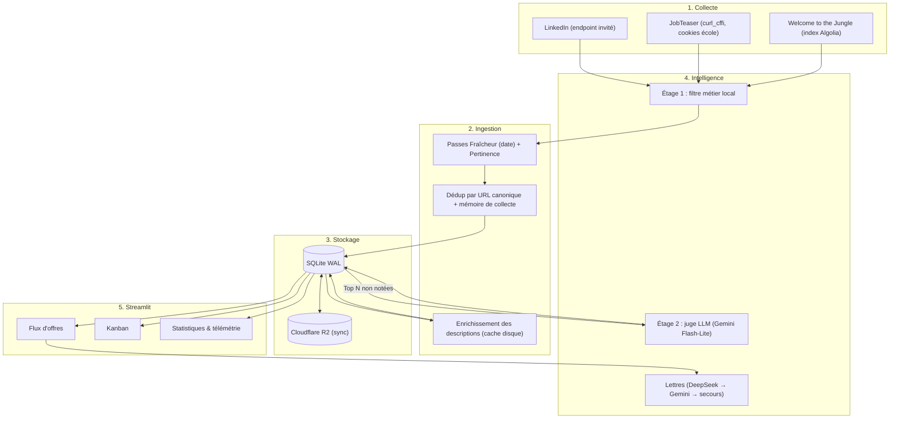

# Stage Copilot — collecte, tri par LLM et candidatures pour un stage de fin d'études

<div align="center">

[](https://recherche-de-stage-ia.streamlit.app/)


%20%2B%20R2-003B57?logo=sqlite&logoColor=white)

[](https://github.com/eddy-decastro/Assistant_de_recherche_de_stage_IA/actions/workflows/ci.yml)

**Un outil personnel qui collecte les offres de stage Data Science / ML / R&D, les trie avec un juge LLM calibré sur mon profil, et rédige des lettres de motivation sur mesure.**

🌐 [recherche-de-stage-ia.streamlit.app](https://recherche-de-stage-ia.streamlit.app/) *(accès protégé par mot de passe)*

[Problème](#-le-problème) • [Architecture](#-architecture) • [Scoring](#-scoring-à-deux-étages) • [Lettres](#-lettres-de-motivation) • [Interface](#-interface-streamlit) • [Installation](#-installation) • [Données personnelles](#-données-personnelles) • [Tests](#-tests)

</div>

---

## 🎯 Le problème

Chercher un PFE en Machine Learning sur les plateformes généralistes, c'est surtout trier du bruit :

1. **Titres trompeurs** : des postes de BI ou de reporting (Power BI, SQL) intitulés « Data Scientist ».
2. **Alternances cachées** : contrats d'apprentissage non signalés dans le titre.
3. **Offres dispersées** : LinkedIn, JobTeaser (intranet école) et Welcome to the Jungle ne se recoupent pas.
4. **Lettres chronophages** : une lettre argumentée par entreprise prend du temps.

Stage Copilot automatise la chaîne complète : **collecter → dédupliquer → noter → suivre → candidater**.

---

## 🏗️ Architecture


```mermaid
flowchart TD
    subgraph Sources ["1. Collecte"]
        LI["LinkedIn (endpoint invité)"]
        JT["JobTeaser (curl_cffi, cookies école)"]
        WTTJ["Welcome to the Jungle (index Algolia)"]
    end

    subgraph Ingestion ["2. Ingestion"]
        P["Passes Fraîcheur (date) + Pertinence"]
        D["Dédup par URL canonique + mémoire de collecte"]
        BF["Enrichissement des descriptions (cache disque)"]
    end

    subgraph Stockage ["3. Stockage"]
        DB[("SQLite WAL")]
        R2[("Cloudflare R2 (sync)")]
    end

    subgraph IA ["4. Intelligence"]
        S1["Étage 1 : filtre métier local"]
        S2["Étage 2 : juge LLM (Gemini Flash-Lite)"]
        GEN["Lettres (DeepSeek → Gemini → secours)"]
    end

    subgraph UI ["5. Streamlit"]
        FEED["Flux d'offres"]
        KB["Kanban"]
        STATS["Statistiques & télémétrie"]
    end

    LI & JT & WTTJ --> S1 --> P --> D --> DB
    DB --> BF --> DB
    DB -->|Top N non notées| S2 --> DB
    DB <--> R2
    DB --> FEED & KB & STATS
    FEED --> GEN
```

| Dossier | Rôle |
|---|---|
| `scrapers/` | Un scraper par source + moteur commun (`base.py`) : passes, quotas, arrêt anticipé, télémétrie |
| `src/ingestion/` | Pont `RawJob` → SQLite, index de la mémoire de collecte |
| `src/matching/` | Juge LLM, notation au fil de l'eau, lettres, export PDF |
| `src/storage/` | SQLite (SQLAlchemy, migrations additives), nettoyage, synchronisation R2 |
| `app.py`, `pages/`, `utils/` | Interface Streamlit |
| `run_scrapers.py` / `run_pipeline.py` | Points d'entrée CLI |

---

## 🧮 Scoring à deux étages

L'étage 1 est gratuit et local ; seules les offres qui le passent partent au LLM, par lots de N, pour respecter le quota gratuit de Gemini.

**Étage 1 — filtre métier local** : les offres BI, RH, commerce ou support (`exclusion_keywords`) sont écartées, et un signal Data Science / ML (`positive_ds_ml_keywords`) est exigé. Un score hybride `sémantique CV ↔ offre (all-MiniLM-L6-v2) + typologie d'entreprise + mots-clés` existe dans `src/matching/scorer.py`, mais le pipeline actuel ne l'utilise plus : la notation est entièrement confiée au juge LLM.

**Étage 2 — juge LLM** (`gemini-flash-lite-latest`, persona *Head of Data*) :

- un **raisonnement écrit avant la note**, pour éviter une note arbitraire ;
- **4 sous-scores de 1 à 5** : `modeling_depth`, `mentorship_team`, `career_leverage`, `pfe_compatibility` ;
- des **verrous bloquants** qui plafonnent la note : alternance ou durée < 5 mois (≤ 15), livrable BI/reporting (≤ 20), hors Île-de-France sans télétravail (≤ 25), « IA » superficielle sans modélisation (≤ 40) ;
- des **garde-fous côté code** : plafond ré-appliqué et verdict re-dérivé de la note, parsing tolérant (`"85/100"`, `"4,5"`…), et repli défensif (jamais d'exception) en cas d'erreur API.

Prompt du juge : [`data/prompt_rerank.txt`](data/prompt_rerank.txt). Réglages : [`config.yaml`](config.yaml).

---

## ✍️ Lettres de motivation

Depuis la fiche d'une offre, un clic génère une lettre de 500 à 650 mots à partir du CV et de la description du poste :

- **cascade de modèles** : DeepSeek (`deepseek-chat`) → Gemini (`gemini-3-flash-preview` puis variantes Flash) → lettre de secours déterministe, sans API ;
- **aucun placeholder** : les `[…]` résiduels sont remplacés par les vraies coordonnées ;
- **langue automatique** : lettre en anglais si l'offre est en anglais ;
- **consigne libre** pour orienter la régénération (ex. « insiste sur la vision par ordinateur ») ;
- **copie en 1 clic** et **export PDF A4** paginé (ReportLab).

> ⚠️ La lettre de secours est générique : relisez-la avant envoi, l'interface indique quelle source l'a produite.

---

## 🖥️ Interface Streamlit

| Page | Contenu |
|---|---|
| **Flux d'offres** (`app.py`) | Offres triées par score, filtres (score, source, statut, typologie, recherche), détails du juge, lettre |
| **Kanban** (`pages/kanban.py`) | Suivi : Nouveau → Postulé → Entretien, plus Ignoré / Rejeté |
| **Statistiques** (`pages/statistiques.py`) | Technologies demandées, répartition géographique, télémétrie des collectes |
| **Pipeline** (`pages/pipeline.py`) | Lancement de la collecte et de la notation en tâche de fond, logs en direct |
| **Paramètres** (`pages/parametres.py`) | Import du CV (PDF/TXT), coordonnées, réglages de collecte, re-notation |

---

## 🚀 Installation

```bash
git clone https://github.com/eddy-decastro/Assistant_de_recherche_de_stage_IA.git
cd Assistant_de_recherche_de_stage_IA
python -m venv .venv
source .venv/bin/activate          # Windows : .\.venv\Scripts\activate
pip install -r requirements.txt
```

### Configuration

```bash
cp .env.example .env                              # clés API, mot de passe, R2, cookies JobTeaser
cp config.local.example.yaml config.local.yaml    # vos coordonnées (non versionné)
cp data/cv_template.txt data/cv_eddy.txt          # votre CV en texte (non versionné)
```

| Variable (`.env`) | Usage |
|---|---|
| `GEMINI_API_KEY` | Juge LLM et lettres (clé gratuite Google AI Studio) |
| `DEEPSEEK_API_KEY` | Optionnel : premier choix pour les lettres |
| `APP_PASSWORD` | Mot de passe de l'interface |
| `R2_ACCOUNT_ID`, `R2_ACCESS_KEY_ID`, `R2_SECRET_ACCESS_KEY`, `R2_BUCKET_NAME` | Optionnel : synchronisation de la base |
| `JOBTEASER_COOKIES` | Optionnel : accès à l'intranet JobTeaser de l'école |

### Lancer

```bash
streamlit run app.py                 # interface sur http://localhost:8501
python run_pipeline.py               # collecte + notation + sync R2
python run_scrapers.py --help        # options fines (--only-source, --trigger-rerank, --top-rerank N…)
```

### Architecture hybride local / cloud

LinkedIn et JobTeaser bloquent souvent les IP de datacenter : la collecte est plus fiable **en local**. La base SQLite est ensuite poussée sur Cloudflare R2, et l'interface hébergée la relit.

```bash
python scripts/sync_db.py --pull     # récupérer les statuts modifiés depuis le cloud
python run_pipeline.py               # collecter et noter en local
python scripts/sync_db.py --push     # publier la base à jour
```

Le workflow [`daily_scraper.yml`](.github/workflows/daily_scraper.yml) lance aussi le pipeline chaque jour depuis GitHub Actions ; attendez-vous à moins de résultats LinkedIn/JobTeaser depuis ces IP.

---

## 🔒 Données personnelles

Aucune donnée personnelle n'est versionnée :

| Donnée | Où la mettre | Versionné ? |
|---|---|---|
| Coordonnées (nom, téléphone, email, liens) | `config.local.yaml`, section `candidate` | Non (`.gitignore`) |
| CV (texte) | `data/cv_eddy.txt`, ou le chemin défini par `scoring.cv_path` | Non (`.gitignore`) |
| Clés API, mots de passe, cookies | `.env` | Non (`.gitignore`) |

La page **Paramètres** écrit automatiquement les coordonnées dans `config.local.yaml` et le CV dans le fichier local, jamais dans `config.yaml`.

**Sur Streamlit Cloud** (pas de fichier local), renseignez les *secrets* de l'application :

```toml
CV_TEXT = """
Texte complet du CV...
"""

[candidate]
name = "Prénom NOM"
phone = "06 00 00 00 00"
email = "prenom.nom@example.com"
```

---

## 🧪 Tests

```bash
pip install -r requirements-dev.txt
python -m pytest
```

Environ 140 tests, avec appels LLM et HTTP mockés : scrapers, collecte hybride, base, ingestion, juge LLM, lettres, PDF, synchronisation cloud, interface (`AppTest`). La CI GitHub Actions les exécute à chaque push sur `main`.

Le journal technique détaillé (mesures, bugs corrigés, décisions) est dans [`AUDIT.md`](AUDIT.md).

---

## ⚖️ Usage

Projet personnel, à usage non commercial. Les collectes restent à faible débit et se limitent aux pages publiques ou à l'intranet de l'école ; respectez les conditions d'utilisation de chaque plateforme.

## 📜 Licence & auteur

Licence **MIT**. Développé par **[Eddy DE CASTRO](https://www.linkedin.com/in/eddy-de-castro/)**, élève-ingénieur aux Mines de Saint-Étienne (double diplôme M2 Mathématiques en Action).
