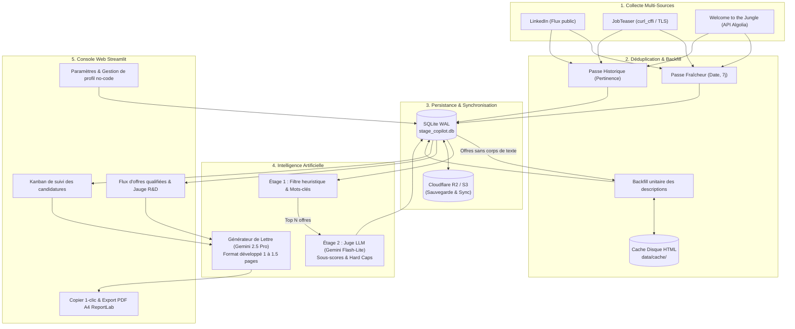

# Stage Copilot — Pipeline d'Agrégation, de Reranking LLM & de Candidature IA

<div align="center">

[](https://recherche-de-stage-ia.streamlit.app/)


%20%2B%20R2-003B57?logo=sqlite&logoColor=white)


**Plateforme complète d'ingénierie pour sourcer, qualifier par IA et générer des candidatures sur mesure pour les stages de fin d'études (PFE) en Data Science, Machine Learning et R&D.**

🌐 **Application en ligne sécurisée :** [recherche-de-stage-ia.streamlit.app](https://recherche-de-stage-ia.streamlit.app/) *(accès privé authentifié)*

[Vue d'ensemble](#-vue-densemble) • [Architecture](#-architecture--pipeline-de-données) • [Générateur de Lettres IA](#-générateur-de-lettres-de-motivation-gemini-25-pro) • [Scoring à Deux Étages](#-système-de-scoring-à-deux-étages) • [Console Streamlit](#-console-de-pilotage-streamlit) • [Déploiement Cloud & R2](#-déploiement-cloud--architecture-hybride) • [Tests](#-tests--qualité-de-code) • [Installation](#-installation--démarrage-rapide)

</div>

---

## 📌 Vue d'ensemble

La recherche d'un stage de fin d'études (PFE) d'excellence en Machine Learning et R&D souffre d'un bruit massif sur les plateformes généralistes :
1. **Titres trompeurs** : Missions de support ou de Business Intelligence (Power BI, SQL basique) présentées sous l'intitulé « Data Scientist ».
2. **Alternances masquées** : Contrats d'apprentissage ou de professionnalisation non signalés dans l'intitulé.
3. **Temps perdu en candidature** : Rédiger des lettres de motivation personnalisées et argumentées prend des heures par entreprise.

**Stage Copilot** résout l'ensemble de la chaîne :
- **Collecte multi-sources hybride** : Scraping asynchrone sur LinkedIn, JobTeaser et Welcome to the Jungle.
- **Scoring à deux étages avec Juge LLM** : Pré-filtrage déterministe local suivi d'un reranking approfondi par un persona *Head of Data* (Gemini).
- **Rédaction de lettres d'excellence (Gemini 2.5 Pro)** : Génération de lettres complètes de 1 à 1,5 pages, 100 % rédigées sans aucun placeholder, prêtes à être copiées en 1 clic ou exportées en PDF multi-pages.
- **Tableau de bord interactif & Kanban** : Suivi des candidatures (*À postuler*, *Postulé*, *Entretien*, *Archivé*) synchronisé dans le Cloud via SQLite et Cloudflare R2.

---

## 🏗️ Architecture & Pipeline de Données


```mermaid
flowchart TD
    subgraph Sources ["1. Collecte Multi-Sources"]
        LI["LinkedIn (Flux public)"]
        JT["JobTeaser (curl_cffi / TLS)"]
        WTTJ["Welcome to the Jungle (API Algolia)"]
    end

    subgraph Ingestion ["2. Déduplication & Backfill"]
        direction TB
        F["Passe Fraîcheur (Date, 7j)"]
        R["Passe Historique (Pertinence)"]
        CACHE[("Cache Disque HTML\ndata/cache/")]
        BF["Backfill unitaire des descriptions"]
    end

    subgraph Stockage ["3. Persistance & Synchronisation"]
        DB[("SQLite WAL\nstage_copilot.db")]
        R2[("Cloudflare R2 / S3\n(Sauvegarde & Sync)")]
    end

    subgraph Intelligence ["4. Intelligence Artificielle"]
        FILTRE["Étage 1 : Filtre heuristique & Mots-clés"]
        JUDGE["Étage 2 : Juge LLM (Gemini Flash-Lite)\nSous-scores & Hard Caps"]
        GEN["Générateur de Lettre (Gemini 2.5 Pro)\nFormat développé 1 à 1.5 pages"]
    end

    subgraph UI ["5. Console Web Streamlit"]
        UI1["Flux d'offres qualifiées & Jauge R&D"]
        UI2["Kanban de suivi des candidatures"]
        UI3["Copier 1-clic & Export PDF A4 ReportLab"]
        UI4["Paramètres & Gestion de profil no-code"]
    end

    LI & JT & WTTJ --> F & R
    F & R --> DB
    DB -->|Offres sans corps de texte| BF
    BF <--> CACHE
    BF --> DB
    DB --> FILTRE
    FILTRE -->|Top N offres| JUDGE
    JUDGE --> DB
    DB <--> R2
    DB --> UI1 & UI2
    UI1 & UI2 --> GEN
    GEN --> UI3
    UI4 --> DB
```

---

## ✍️ Générateur de Lettres de Motivation (Gemini 3.8 Flash)

Pour transformer les offres qualifiées en entretiens réels, l'application intègre un moteur de rédaction sur-mesure alimenté par le modèle de pointe **Gemini 3.8 Flash**.

```
┌────────────────────────────────────────────────────────────────────────┐
│  LETTRE DE MOTIVATION PERSONNALISÉE                                    │
│  Poste : Stage R&D Deep Learning — Mistral AI                          │
├────────────────────────────────────────────────────────────────────────┤
│  Objet : Candidature au stage de fin d'études — Stage R&D Deep Learning│
│                                                                        │
│  Madame, Monsieur,                                                     │
│                                                                        │
│  [Paragraphe 1 : Accroche ciblée & Défis techniques de l'entreprise]  │
│  [Paragraphe 2 : Triple formation d'excellence Maths / IA]             │
│  [Paragraphe 3 & 4 : 2 réalisations R&D en miroir avec le poste]       │
│  [Paragraphe 5 : Disponibilité PFE 6 mois avril 2027 & Collaboration]  │
│                                                                        │
│  Eddy DE CASTRO                                                        │
│  Élève-ingénieur Mines de Saint-Étienne — Double diplôme M2 MAEA       │
│  06 98 82 44 85 | eddyprepa123@gmail.com | LinkedIn | GitHub           │
├────────────────────────────────────────────────────────────────────────┤
│  Consigne optionnelle : [ ex: Insiste sur les Transformers... ]        │
│  [📋 Copier la lettre]   [📄 Télécharger (.pdf)]   [🔄 Régénérer]      │
└────────────────────────────────────────────────────────────────────────┘
```

### Caractéristiques clés :
1. **Format développé académique & percutant (1 à 1,5 pages)** :
   - Calibré entre **500 et 650 mots** avec une argumentation technique rigoureuse.
   - **Règle absolue Zéro Crochet** : Aucun `[...]` ou placeholder non résolu. Tout est rédigé et prêt à l'emploi.
2. **Valorisation du triple cursus** :
   - Double diplôme **Master 2 Mathématiques en Action (MAEA, Mines Saint-Étienne / ENS Lyon)** et diplôme d'ingénieur **IMT Mines Alès** (IA & Data Science).
   - **Licence 3 de Mathématiques Générales à l'Université de Montpellier** menée en parallèle de l'école d'ingénieurs (démontrant une capacité de travail exceptionnelle et une maîtrise poussée en algèbre linéaire, optimisation convexe, probabilités et modélisation stochastique).
3. **Mise en miroir des projets concrets** :
   - Stage R&D à l'**UPC Barcelone** (Graph ML, attaques différentiables PyTorch BPDA/FGSM, validation statistique par bootstrap).
   - Projets d'ingénierie : **MedStay-CI** (quantification d'incertitude conforme certifiée à 89,9 %, régression quantile LightGBM, conteneurisation Docker, 124 tests) ou **CinéFilm IA** (recherche sémantique vectorielle bi-encodeurs E5-Large sous 100 ms).
4. **Export PDF multi-pages A4 (ReportLab)** :
   - Pagination dynamique à deux passes via `NumberedCanvas` (*Page X / Y* en bas de page).
   - Rendu typographique épuré (palette bleu marine `#1E3A8A` et gris ardoise `#1E293B`).
   - Nom de fichier normalisé : **`Lettre de motivation Eddy De Castro - {Entreprise}.pdf`**.
5. **Ergonomie en 1 clic** :
   - Bouton **📋 Copier la lettre** avec feedback visuel vert instantané pour coller directement dans Welcome to the Jungle, JobTeaser ou LinkedIn.
   - Champ de **consigne libre** pour orienter la régénération (ex. *"Insiste sur la vision par ordinateur"*).
   - Compteur de mots et de caractères en temps réel.

---

## 🎯 Système de Scoring Déterministe & Grille v3

Le moteur de qualification combine un filtrage amont sans appel API, un juge sémantique structuré (**Gemini 3.8 Flash**), et un calcul mathématique déterministe en code garantissant l'équité, l'absence de dérive du LLM et le respect de critères éthiques stricts :

```
             [ Ensemble des offres collectées ]
                                │
                                ▼
         ┌──────────────────────────────────────────────┐
         │  1. EXCLUSION PRÉ-LLM & CONTRACTUELLE        │  Coût API : 0 €
         │  - Mots-clés titre (CDI, CDD, alternance...) │  Vitesse : immédiate
         │  - Rejet sans le mot « stage »               │
         └──────────────────────────────────────────────┘
                                │
                      (Offres candidates)
                                │
                                ▼
         ┌──────────────────────────────────────────────┐
         │  2. EXTRACTION STRUCTURÉE LLM (Gemini)       │  Structured Output
         │  - 4 sous-scores (1 à 5)                     │  15 RPM adaptatif
         │  - Typologie (structure_type, rd_nature)     │
         │  - Signaux d'encadrement & données + extraits│
         │  - Détection éthique (défense, trading)      │
         └──────────────────────────────────────────────┘
                                │
                                ▼
         ┌──────────────────────────────────────────────┐
         │  3. NOTE DE QUALITÉ & VÉRIFICATION CITATIONS │  Calcul pur en code
         │  - Formule normalisée (somme des poids = 1.0)│  Tolérance token 80%
         │  - Bonus (+6 encadrant, +3 données, +3 suite)│  Plafond bonus : +10
         │  - Pénalité (-5 benchmark pur)               │
         └──────────────────────────────────────────────┘
                                │
                                ▼
         ┌──────────────────────────────────────────────┐
         │  4. PLANCHERS DE CATÉGORIE & PLAFONDS ÉTHIQUE│  Règles métier
         │  - Plancher 70 : Scale-ups Next40 / FT120    │  Plafonds stricts :
         │  - Plancher 60 : Grands groupes R&D / labos  │  Défense (≤ 10)
         │  - Plancher 50 : Laboratoires publics        │  Trading (≤ 25)
         │  (Sous condition : technical_depth ≥ 3)      │  BI (≤ 30), ESN (≤ 35)
         └──────────────────────────────────────────────┘
                                │
                                ▼
                   [ Flux Qualifié & Tableau Kanban ]
```

### Formule de la Note de Qualité (0 à 100) :
$$\text{quality} = \text{clamp}\left( \frac{\sum w_i s_i - 1}{4} \times 100 + \text{bonus} - \text{pénalité}, 0, 100 \right)$$

- **4 Sous-scores normalisés** :
  - `technical_depth` (35 %) : Densité algorithmique, formulation mathématique, R&D vs wrappers.
  - `learning_environment` (30 %) : Encadrement (PhD, Staff), MLOps, GPU clusters, peer reviews.
  - `target_alignment` (20 %) : Adéquation au profil Mines Saint-Étienne / MAEA (modélisation, UQ, GNN).
  - `logistics` (15 %) : Durée (6 mois idéal, 4-5 mois toléré), localisation et calendrier.
- **Vérification cryptographique & lexicale des signaux** :
  - Tout signal (`encadrant_explicite` +6, `donnees_reelles_explicites` +3, `suite_explicite` +3, `donnees_benchmark_seulement` -5) n'est accordé que si son extrait textuel est **strictement vérifié** dans la description de l'offre (fenêtre glissante, recoupement de tokens $\ge 80\%$). En cas de citation absente ou hallucinatoire, le bonus est annulé et un flag d'audit est consigné.
- **Planchers par Catégorie d'Entreprise** *(actifs si `technical_depth >= 3`)* :
  - **70** : Scale-ups (Next40 2026, FT120 2026, cibles perso IA) hors ESN.
  - **60** : Pôles R&D grands groupes et laboratoires privés.
  - **50** : Laboratoires de recherche publique (Inria, CNRS, CEA).
- **Plafonds Éthiques & Structurels** *(s'appliquent après le plancher et prévalent toujours)* :
  - `DEFENSE` : Plafonné à **10/100** (ex. Helsing, Mistral AI malgré son appartenance au Next40).
  - `TRADING` : Plafonné à **25/100** (finance de marché spéculative).
  - `BI_REPORTING` : Plafonné à **30/100** (dashboards, Excel/PowerBI).
  - `ESN_REGIE` : Plafonné à **35/100** (délégation de personnel sans labo propre).
  - `ENCADREMENT_ABSENT` : Plafonné à **35/100** (stagiaire isolé sans tuteur technique).
  - `SHALLOW_AI` : Plafonné à **40/100** (simple consommation d'API sans modélisation).
- **Verdicts d'action** :
  - **EXCELLENT** ($\ge 85$) • **BON** ($\ge 70$) • **MITIGÉ** ($\ge 50$) • **HORS_SUJET** ($< 50$ ou `EXCLU`).

---

## 💻 Console de Pilotage Streamlit

L'interface multi-pages (`app.py` = routeur `st.navigation`, pages dans `app_pages/`) couvre l'intégralité du workflow, organisée en trois sections : **Veille** (Flux, Candidatures), **Analyse** (Statistiques) et **Système** (Pipeline, Paramètres) :

| Page | Fonctionnalités |
|---|---|
| **Flux (`app_pages/flux.py`)** | Liste dense des offres triées par score R&D et panneau de détail (grille d'évaluation, verdict du juge, fiche), filtres latéraux avancés, actions de candidature et modale de lettre de motivation. Le flux est un composant Streamlit v2 (`components/job_feed/`) avec raccourcis clavier (`j`/`k` naviguer, `o` ouvrir, `l` lettre, `p` postulé, `x` archiver, `?` aide) et annulation des changements de statut. `streamlit run tools/feed_demo.py` lance une démonstration isolée avec des offres factices. |
| **Candidatures (`app_pages/kanban.py`)** | Suivi visuel des candidatures en 5 colonnes (*À postuler*, *Postulé*, *Entretien*, *Refusé*, *Archivé*) avec date d'envoi mémorisée. |
| **Statistiques (`app_pages/statistiques.py`)** | Analytics du marché (distribution des technologies demandées, salaires observés, répartition géographique) et télémétrie des passes de scraping. |
| **Pipeline (`app_pages/pipeline.py`)** | Déclenchement manuel ou asynchrone des passes de collecte et de reranking avec streaming des logs en temps réel. |
| **Paramètres (`app_pages/parametres.py`)** | Dépôt de CV (PDF/TXT), mise à jour no-code des coordonnées candidat (téléphone, email, profils) et édition des critères de recherche. |

---

## ☁️ Déploiement Cloud & Architecture Hybride

Stage Copilot fonctionne en architecture hybride pour concilier contournement anti-bot et persistance 24h/24 :

1. **Collecte locale** : Le scraping lourd s'exécute sur votre machine locale (IP résidentielle) pour contourner les verrous anti-datacenters de LinkedIn et JobTeaser.
2. **Persistance Cloudflare R2** : La base SQLite (`stage_copilot.db`) est automatiquement sauvegardée sur un bucket object storage S3-compatible (Cloudflare R2, gratuit jusqu'à 10 Go).
3. **Tableau de bord Streamlit Cloud / Render** : L'interface web est déployée en continu sur le Cloud, sécurisée par une authentification par mot de passe (`APP_PASSWORD`).

```bash
# Workflow de synchronisation :
python scripts/sync_db.py --pull    # Récupérer les statuts modifiés depuis le smartphone
python run_pipeline.py              # Collecter et qualifier les nouvelles offres en local
python scripts/sync_db.py --push    # Pousser la base à jour vers le Cloud
```

---

## 🧪 Tests & Qualité de Code

Le projet est validé par une suite complète de **151 tests automatisés** couvrant les scrapers, les bases de données, le calcul déterministe de la grille v3, la vérification des citations par fenêtre glissante, le générateur de lettres et le compilateur PDF :

```bash
python -m pytest tests/
```

```text
============================= test session starts =============================
platform win32 -- Python 3.12, pytest-9.1.1
collected 151 items

tests/test_app.py .............                                          [  8%]
tests/test_auth.py ..                                                    [  9%]
tests/test_bridge.py .                                                   [ 10%]
tests/test_cleanup.py .............                                      [ 19%]
tests/test_cli.py .........                                              [ 25%]
tests/test_cloud_storage.py .......                                      [ 29%]
tests/test_cover_letter.py ...............                               [ 39%]
tests/test_database.py ..........                                        [ 46%]
tests/test_enrichment.py ...........                                     [ 53%]
tests/test_hybrid_collection.py ................                         [ 64%]
tests/test_live_scorer.py ..                                             [ 65%]
tests/test_llm_judge.py .............                                    [ 74%]
tests/test_scorer.py ....                                                [ 76%]
tests/test_scoring_v3_constants.py ........                              [ 82%]
tests/test_scrapers.py ..................                                [ 94%]
tests/test_task_manager.py .........                                     [100%]

======================= 151 passed in ~90s =======================
```

---

## 🚀 Installation & Démarrage Rapide

### 1. Cloner le dépôt et configurer l'environnement
```bash
git clone https://github.com/eddy-decastro/Assistant_de_recherche_de_stage_IA.git
cd Assistant_de_recherche_de_stage_IA

python -m venv .venv

# Windows (PowerShell) :
.\.venv\Scripts\activate
# Linux / macOS :
source .venv/bin/activate

pip install -r requirements.txt
```

### 2. Variables d'environnement (`.env`)
Créez un fichier `.env` à la racine à partir de `.env.example` :
```env
# Clé API Google AI Studio (gratuite) pour Gemini
GEMINI_API_KEY=AIzaSy...

# Mot de passe d'accès pour l'interface Streamlit (local & cloud)
APP_PASSWORD=votre_mot_de_passe_secret

# (Optionnel) Identifiants Cloudflare R2 pour la persistance cloud
R2_ACCOUNT_ID=...
R2_ACCESS_KEY_ID=...
R2_SECRET_ACCESS_KEY=...
R2_BUCKET_NAME=...
```

### 3. Lancer l'application Streamlit
```bash
streamlit run app.py
```
L'interface s'ouvre automatiquement sur `http://localhost:8501`.

### 4. Commandes CLI & Maintenance
```bash
# Lancer le pipeline complet (collecte + backfill + rerank)
python run_pipeline.py

# Recalculer instantanément les notes, planchers et plafonds v3 en code pur (0 appel API)
python run_scrapers.py --recompute-scores

# Réévaluer les anciennes offres v1 avec le juge v3 (contrôle strict du quota)
python run_scrapers.py --regrade-v1 --limit 20

# Évaluer le benchmark Golden Set (30 offres annotées, corrélation de Spearman)
python tools/eval_golden.py
```

---

## 📜 Licence & Auteur

Projet distribué sous licence **MIT**.  
Développé par **[Eddy DE CASTRO](https://www.linkedin.com/in/eddy-de-castro/)** — Élève-ingénieur aux Mines de Saint-Étienne (M2 Mathématiques en Action / IMT Mines Alès).
