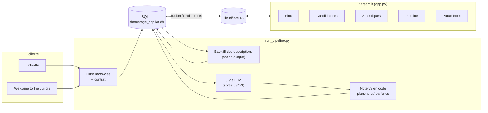

# Stage Copilot

**Veille, qualification par LLM et suivi des candidatures pour un stage de fin d'études en Data Science, Machine Learning et R&D.**

[](https://github.com/eddy-decastro/Assistant_de_recherche_de_stage_IA/actions/workflows/ci.yml)
[](https://github.com/eddy-decastro/Assistant_de_recherche_de_stage_IA/actions/workflows/daily_scraper.yml)


Application en ligne (accès protégé par mot de passe) : [recherche-de-stage-ia.streamlit.app](https://recherche-de-stage-ia.streamlit.app/)

---

## Sommaire

- [Le problème](#le-problème)
- [Fonctionnalités](#fonctionnalités)
- [Architecture](#architecture)
- [Scoring v3](#scoring-v3)
- [Interface](#interface)
- [Installation](#installation)
- [Configuration](#configuration)
- [Utilisation en ligne de commande](#utilisation-en-ligne-de-commande)
- [Déploiement et synchronisation](#déploiement-et-synchronisation)
- [Tests et évaluation](#tests-et-évaluation)
- [Structure du dépôt](#structure-du-dépôt)
- [Limites connues](#limites-connues)

---

## Le problème

Sur les plateformes généralistes, une recherche « Data Scientist stage » remonte surtout du bruit :

- des missions de reporting BI (Power BI, Excel) vendues comme de la data science ;
- des alternances, CDD ou VIE mal étiquetés ;
- des postes d'intégration d'API présentés comme de la R&D en IA ;
- un temps de tri et de rédaction de lettres qui ne passe pas à l'échelle.

Stage Copilot collecte les offres chaque jour, élimine le bruit sans appel API, fait noter les offres restantes par un juge LLM selon une grille explicite, puis aide à candidater (lettre de motivation, suivi Kanban).

## Fonctionnalités

| Domaine | Ce qui est fait |
|---|---|
| **Collecte** | LinkedIn (flux invité) et Welcome to the Jungle (API Algolia). Deux passes : *fraîcheur* (tri par date, fenêtre de 14 jours) et *pertinence*. Arrêt anticipé quand les pages ne contiennent plus que des offres connues. Retry HTTP, cache disque des fiches détail, alerte en cas de source dégradée. |
| **Filtrage** | Exclusion par mots-clés (BI, RH, commercial, support…) puis exigence d'un signal DS/ML dans le titre ou la description. Exclusion des contrats hors stage (CDI, CDD, alternance, VIE…). Déduplication par URL canonique et par entreprise + titre. |
| **Qualification** | Juge LLM (DeepSeek `deepseek-chat` par défaut, Gemini en option) en sortie structurée : 4 sous-scores, typologie d'entreprise, signaux cités. La note finale est calculée en code (planchers, plafonds, vérification des citations). Notation au fil de l'eau pendant la collecte. |
| **Candidature** | Lettre de motivation générée à partir du CV et de l'offre (DeepSeek, puis Gemini en secours, puis gabarit déterministe sans API), consigne libre, copie en un clic, export PDF A4 (ReportLab). |
| **Suivi** | Kanban des candidatures, date d'envoi mémorisée, import des candidatures envoyées hors de l'outil (export Gmail en JSON ou CSV). |
| **Exploitation** | Cron GitHub Actions quotidien, base SQLite partagée via Cloudflare R2 avec fusion à trois points, télémétrie des passes de collecte, statistiques de marché. |

## Architecture


```mermaid
flowchart LR
    subgraph Collecte
        LI[LinkedIn]
        WTTJ[Welcome to the Jungle]
    end

    subgraph Pipeline["run_pipeline.py"]
        F["Filtre mots-clés<br/>+ contrat"]
        BF["Backfill des descriptions<br/>(cache disque)"]
        J["Juge LLM<br/>(sortie JSON)"]
        S["Note v3 en code<br/>planchers / plafonds"]
    end

    DB[("SQLite<br/>data/stage_copilot.db")]
    R2[("Cloudflare R2")]

    subgraph App["Streamlit (app.py)"]
        FL[Flux]
        KB[Candidatures]
        ST[Statistiques]
        PL[Pipeline]
        PA[Paramètres]
    end

    LI & WTTJ --> F --> DB
    DB --> BF --> DB
    DB --> J --> S --> DB
    DB <-->|fusion à trois points| R2
    R2 <--> App
```

Le pipeline tourne soit en local (IP résidentielle, moins de blocages), soit chaque jour à 06:00 UTC dans GitHub Actions. L'application Streamlit et le pipeline travaillent chacun sur une copie de la base ; avant chaque téléversement sur R2, les changements distants sont rejoués ligne par ligne (`src/storage/db_merge.py`). En cas de conflit sur les colonnes saisies par l'utilisateur (`status`, `rejection_reason`, `applied_at`), la version de l'application gagne.

## Scoring v3

Le LLM n'attribue pas la note finale. Il extrait des éléments structurés ; le code calcule la note de façon déterministe et reproductible (`src/matching/scoring_v3.py`, paramètres dans `config.yaml`, section `scoring_v3`).

```
offres collectées
  └─ 1. Exclusion sans API      titre contenant CDI, CDD, alternance, VIE… → EXCLU
  └─ 2. Extraction LLM          4 sous-scores (1 à 5), typologie, signaux + citations
  └─ 3. Note de qualité         moyenne pondérée + bonus vérifiés
  └─ 4. Planchers puis plafonds règles métier, les plafonds l'emportent toujours
```

**Note de qualité (0 à 100)**

$$\text{quality} = \text{clamp}\left(\frac{\sum_i w_i s_i - 1}{4} \times 100 + \text{bonus} - \text{pénalité},\ 0,\ 100\right)$$

| Sous-score | Poids | Mesure |
|---|---|---|
| `technical_depth` | 0,35 | Modélisation réelle vs consommation d'API |
| `learning_environment` | 0,30 | Encadrement, environnement technique |
| `target_alignment` | 0,20 | Adéquation au profil (modélisation, UQ, GNN…) |
| `logistics` | 0,15 | Durée, lieu, calendrier |

**Bonus et pénalité**, accordés seulement si la citation fournie par le LLM se retrouve dans le texte de l'offre (fenêtre glissante, au moins 80 % des tokens) : encadrant explicite +6, données réelles +3, perspective de suite +3 (plafond +10), données de benchmark uniquement −5. Une citation introuvable annule le bonus et ajoute le drapeau `[CITATION_NON_VERIFIEE]`.

**Planchers** (si `technical_depth ≥ 3`) : 70 pour les scale-ups (Next40, FT120, cibles personnelles), 60 pour les pôles R&D de grands groupes, 50 pour les laboratoires publics.

**Plafonds** : défense 10, trading 25, BI/reporting 30, ESN en régie 35, encadrement absent 35, IA superficielle 40.

**Verdicts** : `EXCELLENT` ≥ 85, `BON` ≥ 70, `MITIGÉ` ≥ 50, `HORS_SUJET` en dessous.

Les listes d'entreprises (scale-ups, groupes R&D, défense, ESN) et tous les seuils se modifient dans `config.yaml`. Après modification, `--recompute-scores` recalcule toutes les notes sans appel API.

## Interface

`app.py` sert de routeur (`st.navigation`) vers les pages de `app_pages/`.

| Page | Contenu |
|---|---|
| **Flux** | Offres triées par score, panneau de détail (grille, verdict, fiche), filtres, actions de statut avec annulation, lettre de motivation. Composant Streamlit v2 (`components/job_feed/`) avec raccourcis clavier : `j`/`k` naviguer, `o` ouvrir, `l` lettre, `p` postulé, `x` archiver, `?` aide. |
| **Candidatures** | Kanban : à postuler, postulé, entretien, refusé, archivé. |
| **Statistiques** | Technologies demandées, salaires observés, géographie, télémétrie des passes de collecte. |
| **Pipeline** | Lancement de la collecte et du reranking depuis l'interface, logs en direct. |
| **Paramètres** | Dépôt du CV (PDF ou TXT), coordonnées du candidat, critères de recherche. |

`streamlit run tools/feed_demo.py` lance le composant de flux seul, avec des offres factices.

## Installation

Prérequis : Python 3.11 ou 3.12.

```bash
git clone https://github.com/eddy-decastro/Assistant_de_recherche_de_stage_IA.git
cd Assistant_de_recherche_de_stage_IA
python -m venv .venv
```

```bash
# Windows
.venv\Scripts\activate
# Linux / macOS
source .venv/bin/activate
```

Trois fichiers de dépendances :

| Fichier | Usage |
|---|---|
| `requirements.txt` | Application, pipeline et cron (sans PyTorch) ; utilisé par Streamlit Cloud et GitHub Actions |
| `requirements-dev.txt` | `requirements.txt` + `pytest`, `torch` CPU, `sentence-transformers` (score bi-encodeur historique) et `playwright` (capture du cookie JobTeaser) |
| `requirements-render.txt` | Alias de `requirements.txt`, point d'entrée de `render.yaml` |
| `requirements-lint.txt` | `ruff`, `mypy` et leurs stubs (à installer avec `requirements.txt`) |

```bash
pip install -r requirements-dev.txt
```

Ensuite :

1. Copier `.env.example` en `.env` et renseigner au moins une clé LLM (voir ci-dessous).
2. Créer son profil, sans rien committer : le dépôt est public, le CV et les coordonnées privées n'y figurent pas. Le plus simple est d'ouvrir la page **Paramètres** : le CV est écrit dans `data/cv_eddy.txt` et les coordonnées dans `data/candidate.local.yaml`, deux fichiers ignorés par git. À la main : copier `data/cv_template.txt` en `data/cv_eddy.txt` et le remplir.
3. Adapter la section `candidate` de `config.yaml` (nom, titre, liens publics : signature des lettres).

```bash
streamlit run app.py
```

L'application s'ouvre sur `http://localhost:8501`. Sans `APP_PASSWORD`, l'accès local est libre.

## Configuration

### Variables d'environnement (`.env`)

| Variable | Rôle |
|---|---|
| `DEEPSEEK_API_KEY` | Juge LLM (fournisseur par défaut) et lettres de motivation |
| `GEMINI_API_KEY` | Juge si `llm.provider: google`, secours pour les lettres |
| `APP_PASSWORD` | Mot de passe de l'interface ; vide = accès libre |
| `R2_ACCOUNT_ID`, `R2_ACCESS_KEY_ID`, `R2_SECRET_ACCESS_KEY`, `R2_BUCKET_NAME` | Synchronisation de la base sur Cloudflare R2 (optionnel) |
| `S3_ENDPOINT_URL`, `AWS_ACCESS_KEY_ID`, `AWS_SECRET_ACCESS_KEY`, `S3_BUCKET_NAME` | Alternative S3 générique |
| `CANDIDATE_PHONE`, `CANDIDATE_EMAIL` | Coordonnées privées des lettres, là où le fichier local n'existe pas (Streamlit Cloud, Render) |
| `CANDIDATE_CV` | Texte complet du CV, pour le cron GitHub et l'hébergement ; sans fichier `data/cv_eddy.txt`, il est lu ici |
| `JOBTEASER_*` | Uniquement si la source JobTeaser est réactivée |

La clé lue pour le juge dépend du fournisseur : `llm.provider: deepseek` lit `DEEPSEEK_API_KEY`, `google` lit `GEMINI_API_KEY`, tout autre fournisseur compatible OpenAI lit `<PROVIDER>_API_KEY` (avec `llm.base_url` adapté).

### `config.yaml`

| Section | Contenu |
|---|---|
| `scrapers` | Sources actives, requêtes, passes fraîcheur/pertinence, mots-clés d'exclusion et de détection DS/ML |
| `scoring_v3` | Contrats exclus, planchers, bonus, plafonds, seuils des verdicts |
| `companies` | Listes scale-ups, groupes R&D, défense, double usage, ESN |
| `llm` | Fournisseur, modèle, limites de débit (RPM/RPD), parallélisme, modèle des lettres |
| `ranking` | Nombre d'offres envoyées au juge par défaut |
| `candidate` | Champs publics affichés dans les lettres (nom, titre, liens). Téléphone et email : voir `src/candidate.py` |

## Utilisation en ligne de commande

```bash
# Pipeline complet : synchro R2 → collecte → backfill → reranking → synchro R2
python run_pipeline.py
python run_pipeline.py --no-sync

# Recalcul des notes v3 en code, sans appel API
python run_pipeline.py --recompute-scores

# Réévaluation des anciennes offres v1 avec le juge v3
python run_pipeline.py --regrade-v1 --limit 20
```

`run_scrapers.py` expose les étapes une à une :

```bash
python run_scrapers.py --only-source wttj --passes freshness   # collecte ciblée
python run_scrapers.py --no-collect --trigger-rerank --top-rerank 50
python run_scrapers.py --dedupe --revalidate --dry-run          # hygiène de la base
python run_scrapers.py --no-collect --top-telemetry 10          # dernières passes tracées
python run_scrapers.py --help
```

Autres outils :

```bash
python backfill_descriptions.py --limit 50                  # descriptions manquantes
python scripts/sync_db.py --status                          # état local vs R2
python scripts/sync_db.py --pull                            # récupère la base distante
python scripts/sync_db.py --push                            # téléverse (avec fusion)
python tools/import_applications.py candidatures.json       # aperçu de l'import
python tools/import_applications.py candidatures.json --apply
python tools/auto_import.py                                 # imports déposés dans data/imports/
python tools/eval_golden.py                                 # évaluation sur le golden set
```

## Déploiement et synchronisation

- **Cron quotidien** (`.github/workflows/daily_scraper.yml`) : 06:00 UTC, lance `run_pipeline.py`. Secrets attendus : `DEEPSEEK_API_KEY`, `GEMINI_API_KEY`, `R2_*` et `CANDIDATE_CV`. Le cache des fiches détail est conservé entre deux runs.
- **Interface** : Streamlit Community Cloud (`requirements.txt`) ou Render (`render.yaml`, `requirements-render.txt`). Définir `APP_PASSWORD`, les variables `R2_*` (pour que l'application lise et écrive la même base que le cron) et `CANDIDATE_CV`, `CANDIDATE_PHONE`, `CANDIDATE_EMAIL` (sans eux, aucune lettre ne peut être personnalisée). Sur Streamlit Cloud, ce sont des secrets de premier niveau, exposés en variables d'environnement.
- **Synchronisation** : chaque copie garde un point de synchronisation (`*.db.sync_base` et ETag). Le téléversement est conditionnel à l'ETag ; si la base distante a changé, elle est fusionnée avant un nouvel essai.

## Tests et évaluation

```bash
python -m pytest
```

260 tests (environ 4 minutes en local) couvrent les scrapers, l'ingestion, la base et la fusion R2, le calcul de la note v3, la vérification des citations, le juge LLM (client simulé), les lettres et le PDF, l'authentification, le profil candidat, le composant de flux et les pages Streamlit (`AppTest`).

La CI (`.github/workflows/ci.yml`) exécute, à chaque push et pull request sur `main`, deux jobs :

```bash
ruff check .   # erreurs réelles : imports inutiles, noms indéfinis, variables mortes
mypy           # cliquet : les modules en erreur sont listés dans pyproject.toml, aucun nouveau n'est toléré
```

**Golden set.** `tests/test_golden_regression.py` rejoue les règles de scoring sur les 30 offres annotées de `data/golden_set.csv` et impose Spearman ≥ 0,90, précision de catégorie ≥ 75 %, aucune exclusion à tort et aucune offre de défense au-dessus de son plafond. Il n'appelle pas le LLM : il protège les règles de code et `config.yaml`, pas la qualité du juge. `python tools/eval_golden.py` affiche le détail offre par offre.

## Structure du dépôt

```
app.py                  routeur Streamlit
app_pages/              pages de l'interface
components/job_feed/    composant Streamlit v2 du flux (HTML/CSS/JS)
utils/                  authentification, styles, chargement des données, tâches de fond
scrapers/               sources (linkedin, wttj, jobteaser), HTTP, cache, santé des sources
src/ingestion/          pont RawJob → base, index des offres connues
src/matching/           scoring_v3 (note), llm_judge (juge), llm_providers, judge_schema, lettres, export PDF, score bi-encodeur
src/candidate.py        CV et coordonnées du candidat (hors dépôt)
src/env.py              chargement de .env et des secrets Streamlit
src/storage/            SQLAlchemy, nettoyage, stockage R2, fusion à trois points
run_pipeline.py         point d'entrée du pipeline complet
run_scrapers.py         collecte, rerank et maintenance étape par étape
backfill_descriptions.py
scripts/, tools/        synchronisation, import, évaluation, sondes de diagnostic
tests/                  suite pytest
docs/superpowers/       spécifications, plans et diagnostics
config.yaml             paramètres métier
```

## Limites connues

- **JobTeaser désactivé** depuis le 30/09/2026 (accès au compte école perdu, conditions d'utilisation). Le code reste en place ; réactivation via `scrapers.enabled_sources`.
- **LinkedIn** est lu via le flux public sans compte : volume limité, réponses 429 possibles, structure HTML susceptible de changer.
- La note dépend en partie du LLM : deux appels sur la même offre peuvent différer légèrement malgré `temperature: 0`.
- **La qualité du juge LLM n'est pas mesurée automatiquement.** Le golden set vérifie les règles de code (planchers, plafonds, exclusions), pas ce que le modèle répond ; une régression du prompt ne serait pas détectée par la CI.
- **Typage partiel** : une dizaine de modules sont exclus de mypy (liste dans `pyproject.toml`), dont `src/storage/database.py` tant que les modèles SQLAlchemy utilisent `Column()`.
- La grille et les listes d'entreprises reflètent un profil précis (ML, modélisation, R&D) et des choix personnels (exclusion défense et trading).

## Licence

MIT. Développé par [Eddy De Castro](https://www.linkedin.com/in/eddy-de-castro/), élève-ingénieur IMT Mines Alès, double diplôme M2 Mathématiques en Action (Mines Saint-Étienne).
